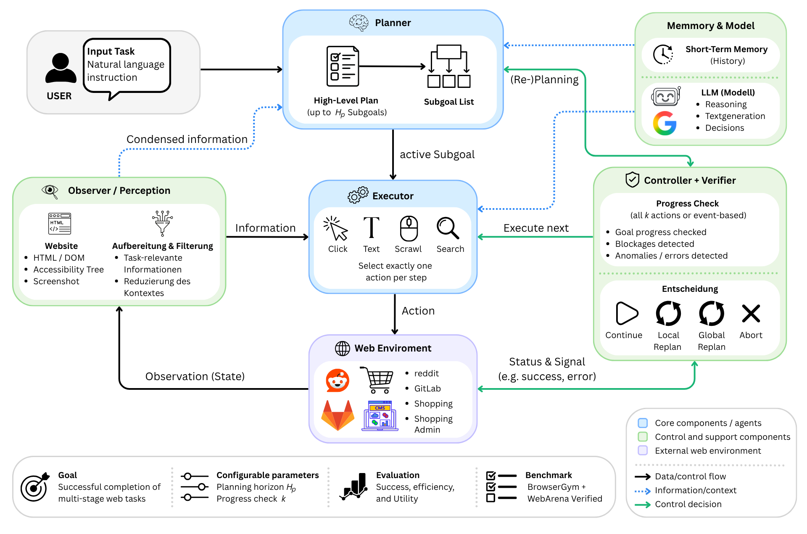
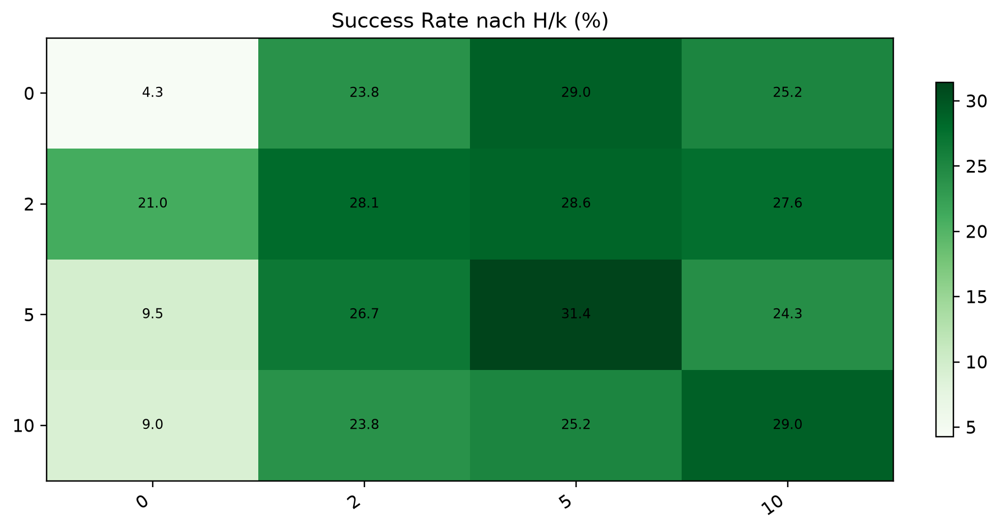
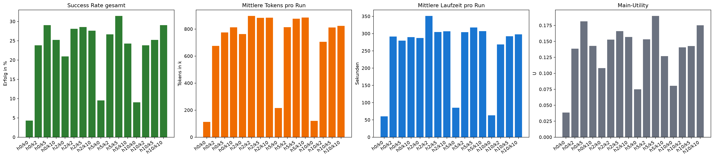

# H/k-Agent v3 for WebArena-Verified

This repository contains the implementation and final analysis artifacts for a
master thesis on long-horizon LLM web agents. The project is inspired by
[Plan-and-Act](https://github.com/SqueezeAILab/plan-and-act): planning and
execution are separated, but the final system is an own H/k-controlled
WebArena-Verified agent implemented under `scripts/hk_agent/`.

Benchmark repository:
[ServiceNow/webarena-verified](https://github.com/ServiceNow/webarena-verified)

Thesis PDF:
[docs/thesis/thesis.pdf](docs/thesis/thesis.pdf)

SLR documentation:
[docs/thesis/Dokumentation der Systematic Literature Review.xlsx](<docs/thesis/Dokumentation der Systematic Literature Review.xlsx>)

The thesis studies how the planning horizon `H_P` and the runtime control
interval `k` affect task success, process behavior, token cost, and wall-clock
time on WebArena-Verified Hard tasks. In the final experiment, 16 `H_P/k`
treatments were evaluated on 210 single-site tasks. The best global task success
rate in the reported results is reached at `H_P=5, k=5`.

## Architecture

The H/k agent separates planning, execution, runtime evaluation, and control.
The Planner creates bounded high-level plans, the Executor maps the current
subgoal to BrowserGym actions, and the Runtime Evaluator checks progress every
`k` steps. The Controller then decides whether the agent continues, repairs the
current plan, replans, or aborts.



Further architecture material:

- `docs/architecture/hk_agent_gesamtarchitektur.png`
- `docs/architecture/task44_complete_example_flow.drawio.pdf`
- `docs/architecture/planner_prompt_composition.drawio.pdf`
- `docs/architecture/runtime_hk_v3_precise_process_final.drawio.pdf`
- `docs/architektur_und_umsetzung_hk_agent.md`
- `docs/task_44_durchfuehrung_beispiel.md`
- `docs/thesis/thesis.pdf`
- `docs/thesis/Dokumentation der Systematic Literature Review.xlsx`

## Abstract

Mehrstufige browserbasierte Arbeitsabläufe sind in Unternehmen weit verbreitet
und umfassen häufig wiederkehrende manuelle Interaktionen mit Webanwendungen
und Portalen. LLM-basierte Webagenten bieten das Potenzial, solche Abläufe
selbstständig zu bearbeiten. Bei diesen *Long-Horizon-Webaufgaben* müssen sie
jedoch über viele zustandsabhängige Schritte hinweg planen und ihr Vorgehen an
Veränderungen der Webumgebung anpassen. Bislang ist unzureichend untersucht,
wie weit vorausgeplant und in welchen Abständen der Ausführungsfortschritt
überprüft werden sollte und wie sich beide Mechanismen auf Aufgabenerfolg und
Ressourcenaufwand auswirken.

Diese Arbeit untersucht den Einfluss des Planungshorizonts `H_P` und des
Kontrollintervalls `k` auf Aufgabenerfolg, Prozessverhalten und
Ressourcenaufwand LLM-basierter Webagenten. Aufbauend auf einer *Systematic
Literature Review* wurde eine modulare Webagentenarchitektur entwickelt und in
einem vollfaktoriellen Experiment untersucht. Dabei wurden 16 Kombinationen
beider Faktoren auf 210 Single-Site-Tasks aus *WebArena Verified Hard*
ausgeführt. Bewertet wurden die *Task Success Rate*, Prozessmetriken,
Inferenzkosten und *Wall-Clock Time*. Ergänzend wurden Aufgabenerfolg,
Inferenzkosten und Ausführungszeit zu einer relativen Trade-off-Bewertung
zusammengeführt.

Die Ergebnisse des kontrollierten Experiments zeigen, dass planmäßige
Fortschrittskontrolle unter den untersuchten Bedingungen die deutlichere
positive Gestaltungsgröße für den Aufgabenerfolg ist als die alleinige
Begrenzung des Planungshorizonts. `H_P=5` und `k=5` erreicht mit `31,4 %` die
höchste globale *Task Success Rate* und zugleich den günstigsten beobachteten
Trade-off zwischen Aufgabenerfolg, Inferenzkosten und Ausführungszeit unter
einer erfolgsorientierten Bewertung. Full-Horizon-Planning mit `k=5` erreicht
einen nur geringfügig niedrigeren Aufgabenerfolg, benötigt jedoch weniger Tokens
und eine kürzere Ausführungszeit und liegt daher in der Trade-off-Bewertung nur
knapp dahinter. Eine höhere Kontrollfrequenz geht zudem mit häufigerem
Replanning einher, ohne dass eine höhere Replanning-Rate durchgehend mit höherem
Aufgabenerfolg verbunden ist.

Die zusätzliche Begrenzung des Planungshorizonts kann den Aufgabenerfolg weiter
erhöhen, ihr Vorteil relativiert sich jedoch, sobald Inferenzkosten und
Ausführungszeit berücksichtigt werden. Die Ergebnisse unterstreichen damit die
Bedeutung planmäßiger Fortschrittskontrolle gegenüber einer bloßen
Intensivierung von Planung oder Replanning. Für ressourcenbewusste Webagenten
ist daher nicht allein der maximale Aufgabenerfolg entscheidend, sondern der
anwendungsspezifische Trade-off zwischen Aufgabenerfolg, Inferenzkosten und
Ausführungszeit.

## Presentation Short Version

The project asks a practical agent-design question:

> How far should an LLM web agent plan ahead, and how often should it check
> whether execution is still making progress?

The answer is tested with a modular Planner/Executor architecture. The Planner
creates high-level subgoals, the Executor turns the current subgoal into one
BrowserGym action, the Runtime Evaluator checks progress every `k` steps, and
the Controller decides whether to continue, repair/replan, or abort. The
official WebArena-Verified evaluator decides benchmark success after the run.

Core H/k result: the success heatmap summarizes how task success changes across
planning horizon `H_P` and control interval `k`.



Utility and resource overview: the analysis combines task success, token cost,
and runtime into a relative trade-off view.



## Repository Layout

```text
.
├── docs/
│   ├── architecture/                 # architecture figures for thesis/presentation
│   ├── thesis/thesis.pdf             # thesis PDF copy
│   ├── thesis/Dokumentation der Systematic Literature Review.xlsx
│   ├── architektur_und_umsetzung_hk_agent.md
│   └── task_44_durchfuehrung_beispiel.md
├── external/
│   └── README.md                     # how to clone WebArena-Verified locally
├── notebooks/
│   ├── final_analysis.ipynb          # final analysis notebook
│   ├── results_discussion_chapter.ipynb
│   └── formalevla.ipynb              # appendix discussion of utility formulas
├── prompts/
│   └── v3/                           # final Planner/Executor/site prompts
├── scripts/
│   ├── run_hk_agent_experiment.py    # main experiment runner
│   ├── vertex_ollama_proxy.py        # Ollama-compatible Vertex AI proxy
│   ├── hk_agent/                     # H/k agent implementation
│   └── webarena_exp/                 # WebArena-Verified integration
└── thesis_results_output/
    ├── data/final_summary.csv
    ├── data/final_summary.json
    ├── tables/
    └── figures/
```

`runs/`, local caches, local virtual environments, and the local
`external/webarena-verified/` clone are ignored by Git.

## 1. Install This Repository

Use Python 3.12. The project was developed with a local `.venv`.

```bash
cd /Users/niclascramer/Privat/Uni/Uni-Reutlingen/Masterarbeit/05_Code

/opt/homebrew/bin/python3.12 -m venv .venv
source .venv/bin/activate
python -m pip install --upgrade pip
pip install -r requirements.txt
playwright install chromium
```

Create a local environment file from the template:

```bash
cp .env.example .env
```

Before running commands that need WebArena or Google variables, load it in the
current shell:

```bash
set -a
source .env
set +a
```

Quick import/syntax check:

```bash
.venv/bin/python -m compileall -q scripts
```

## 2. Install WebArena-Verified

The upstream WebArena-Verified repository is not vendored in this repository.
Clone it locally into `external/`:

```bash
mkdir -p external
cd external
git clone https://github.com/ServiceNow/webarena-verified.git
cd webarena-verified
```

Official documentation:

- https://servicenow.github.io/webarena-verified/latest/
- https://github.com/ServiceNow/webarena-verified

Verify that the CLI is available. Either use the package from this environment:

```bash
cd /Users/niclascramer/Privat/Uni/Uni-Reutlingen/Masterarbeit/05_Code
source .venv/bin/activate
.venv/bin/webarena-verified --help
```

or use `uvx` as shown in the official WebArena-Verified quick start:

```bash
uvx webarena-verified --help
```

## 3. Docker or Lima

WebArena-Verified sites run as Docker containers. On macOS, either Docker
Desktop or Lima can provide the Docker engine.

Docker Desktop path:

```bash
docker version
docker run --rm hello-world
```

Lima path:

```bash
brew install lima docker
limactl start template://docker
docker context create lima-docker --docker "host=unix://${HOME}/.lima/docker/sock/docker.sock"
docker context use lima-docker
docker run --rm hello-world
```

If the Docker context already exists, just select it:

```bash
docker context use lima-docker
```

## 4. Start WebArena-Verified GitLab

Task 44 is a GitLab task. Start only the GitLab site for the smallest runnable
example:

```bash
source .venv/bin/activate
.venv/bin/webarena-verified env start --site gitlab --port 8023 --timeout 300
```

Expected local URL:

```text
http://localhost:8023
```

The runner uses these default credentials for the BrowserGym/WebArena-Verified
environment:

```bash
set -a
source .env
set +a
```

Useful service checks:

```bash
curl -I http://localhost:8023/users/sign_in
.venv/bin/python scripts/run_services_probe.py --sites gitlab
```

## 5. Google Vertex AI via Ollama-Compatible Proxy

The experiment runner talks to an Ollama-compatible `/api/chat` endpoint. In the
Google setup this endpoint is local, but the actual model call is sent to Google
Vertex AI MaaS by `scripts/vertex_ollama_proxy.py`.

Authenticate once:

```bash
gcloud auth application-default login
gcloud config set project <your-google-cloud-project>
```

Set the project and model variables:

```bash
set -a
source .env
set +a
```

Start the proxy in a separate terminal:

```bash
source .venv/bin/activate
set -a
source .env
set +a

.venv/bin/python scripts/vertex_ollama_proxy.py \
  --host 127.0.0.1 \
  --port 11435 \
  --project-id "$GOOGLE_CLOUD_PROJECT" \
  --location "$GOOGLE_CLOUD_LOCATION" \
  --publisher "$VERTEX_MAAS_PUBLISHER" \
  --model "$VERTEX_MAAS_MODEL" \
  --force-default-model \
  --timeout-seconds 600
```

Check the proxy:

```bash
curl -sS http://127.0.0.1:11435/api/chat \
  -H 'Content-Type: application/json' \
  -d '{"model":"gemma4:26b","messages":[{"role":"user","content":"Return only ok."}],"stream":false,"options":{"num_predict":20}}'
```

The response should contain an assistant message with `ok`.

## 6. Run WebArena-Verified Task 44

This is the smallest concrete run for the presentation and for checking that the
agent, WebArena-Verified GitLab, BrowserGym, and the Google proxy are wired
together.

```bash
cd /Users/niclascramer/Privat/Uni/Uni-Reutlingen/Masterarbeit/05_Code
source .venv/bin/activate
set -a
source .env
set +a

NODE_OPTIONS=--max-old-space-size=8192 \
.venv/bin/python scripts/run_hk_agent_experiment.py \
  --experiment-name hk-agent-browsergym-planact-main-v02_basis_v3 \
  --task-ids 44 \
  --hs 0 2 5 10 \
  --ks 0 2 5 10 \
  --run-mode agent \
  --planner-model gemma4:26b \
  --executor-model gemma4:e4b \
  --agent-architecture v3 \
  --max-steps-policy tiered \
  --max-steps-navigation 20 \
  --max-steps-retrieval 30 \
  --max-steps-policy-task 25 \
  --max-steps-mutation 50 \
  --max-planner-calls 0 \
  --planner-call-margin 2 \
  --max-steps 500 \
  --llm-timeout-seconds 600 \
  --max-consecutive-llm-timeouts 0 \
  --success-policy contamination_adjusted \
  --ollama-base-url http://127.0.0.1:11435 \
  --reset-site-before-mutate \
  --site-reset-timeout-seconds 300 \
  --resume-summary \
  --replace-requested-runs \
  --refresh-existing-diagnostics
```

What this command does:

- `--task-ids 44` runs the WebArena-Verified GitLab Task 44.
- `--hs 0 2 5 10` and `--ks 0 2 5 10` run the full 4x4 H/k matrix for that
  task.
- `--run-mode agent` removes evaluator/oracle information from the agent inputs.
- `--agent-architecture v3` uses the final H/k controller architecture.
- `--ollama-base-url http://127.0.0.1:11435` routes Planner and Executor calls
  through the local Vertex proxy.
- `--resume-summary` keeps existing summary rows.
- `--replace-requested-runs` reruns only the requested Task/H/k combinations.

Run artifacts are written under:

```text
runs/hk-agent/hk-agent-browsergym-planact-main-v02_basis_v3/
```

Important files:

```text
summary.csv
summary.json
experiment_config.json
selected_tasks.json
<task>/<h>/<k>/run_summary.json
<task>/<h>/<k>/step_trace.jsonl
<task>/<h>/<k>/agent_response.json
<task>/<h>/<k>/eval_result.json
```

## 7. Full Experiment and Resume

For the thesis-scale experiment, replace `--task-ids 44` with a task selection
from WebArena-Verified Hard, for example by using the runner's sampling flags or
an explicit task list. Keep `--resume-summary` enabled for long runs.

For existing runs, refresh diagnostics without rerunning browser interaction:

```bash
.venv/bin/python scripts/run_hk_agent_experiment.py \
  --experiment-name hk-agent-browsergym-planact-main-v02_basis_v3 \
  --task-ids 44 \
  --hs 0 2 5 10 \
  --ks 0 2 5 10 \
  --run-mode agent \
  --agent-architecture v3 \
  --ollama-base-url http://127.0.0.1:11435 \
  --resume-summary \
  --refresh-existing-diagnostics \
  --refresh-existing-only
```

## 8. Analyse and Thesis Results

Final result data and derived thesis artifacts are stored in:

```text
thesis_results_output/data/final_summary.csv
thesis_results_output/data/final_summary.json
thesis_results_output/tables/
thesis_results_output/figures/
```

Key result figures:

- `thesis_results_output/figures/fig_01_success_heatmap.png`: H/k success
  heatmap for the main treatment matrix.
- `thesis_results_output/figures/section_04_global_hk_metric_bars.png`: compact
  overview of success, token consumption, runtime, and utility.

Relevant notebooks:

- `notebooks/final_analysis.ipynb`: central final analysis over
  `thesis_results_output/data/final_summary.*`.
- `notebooks/results_discussion_chapter.ipynb`: additional result-discussion
  tables and figures, especially H/k and utility comparisons.
- `notebooks/formalevla.ipynb`: appendix-oriented discussion and derivation of
  the utility-function formulas used for the trade-off evaluation.

Run the final analysis notebook:

```bash
env JUPYTER_PATH=.jupyter MPLCONFIGDIR=/private/tmp/mpl-cache \
.venv/bin/python -m jupyter nbconvert \
  --to notebook \
  --execute notebooks/final_analysis.ipynb \
  --output final_analysis.executed.ipynb \
  --output-dir /private/tmp
```

Note: `final_analysis.ipynb` reads `thesis_results_output/data/final_summary.*`.
It does not overwrite the source summary files. Table exports are disabled by
default in the notebook because the current table folder contains final thesis
artifacts from more than one analysis notebook; see
`thesis_results_output/tables/README.md`.

## 9. Relation to Plan-and-Act

Plan-and-Act separates high-level planning from low-level execution for
long-horizon agent tasks. This repository follows that design intuition, but the
implementation is adapted to WebArena-Verified and the thesis experiment:

- Plan-and-Act background: Planner and Executor as explicit components.
- This work: controlled `H_P/k` treatments, BrowserGym action grounding,
  runtime verification, official WebArena-Verified evaluation, and structured
  experiment artifacts.
- The original Plan-and-Act repository is not required to run this project.

## Troubleshooting

If the GitLab service is not reachable:

```bash
docker ps
curl -I http://localhost:8023/users/sign_in
.venv/bin/webarena-verified env start --site gitlab --port 8023 --timeout 300
```

If the proxy check fails:

```bash
echo "$GOOGLE_CLOUD_PROJECT"
gcloud auth application-default print-access-token >/dev/null
curl -sS http://127.0.0.1:11435/api/tags
```

If BrowserGym cannot find the task environment, reinstall the Python
dependencies after cloning WebArena-Verified:

```bash
source .venv/bin/activate
pip install -r requirements.txt
python -c "import browsergym.webarena_verified, webarena_verified; print('ok')"
```

## Sources

- Thesis PDF: `docs/thesis/thesis.pdf`
- WebArena-Verified documentation: https://servicenow.github.io/webarena-verified/latest/
- Plan-and-Act repository: https://github.com/SqueezeAILab/plan-and-act
