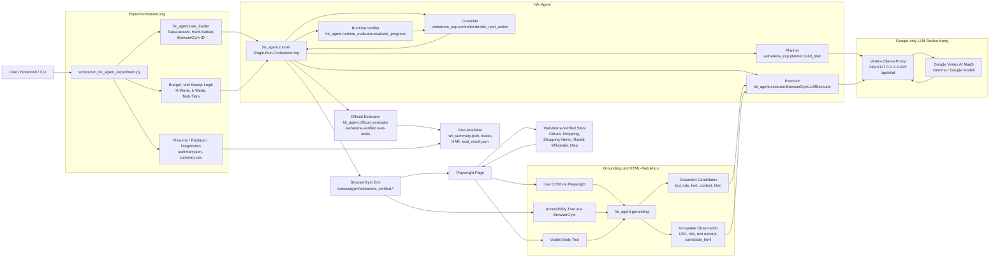
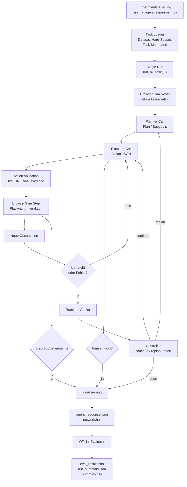
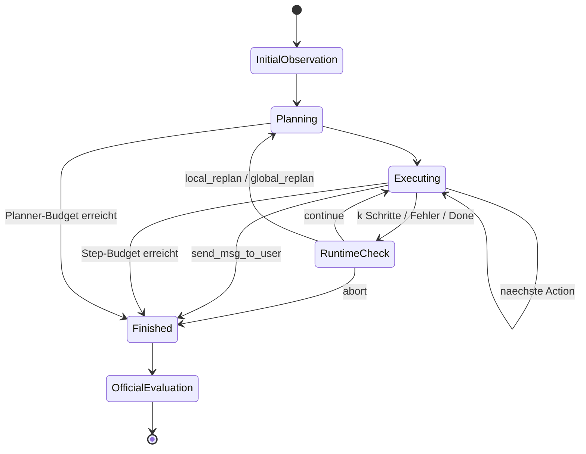
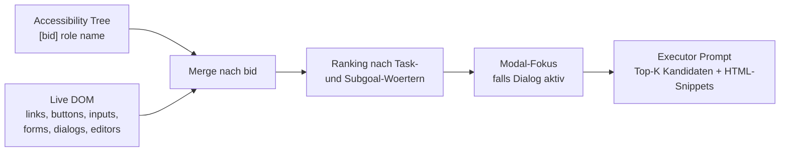
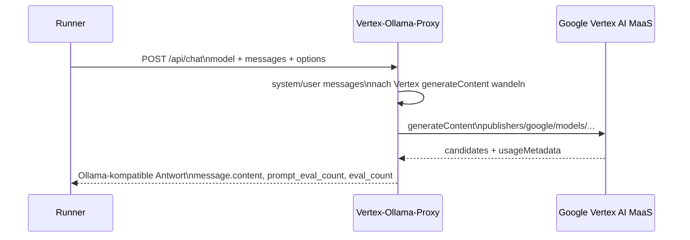
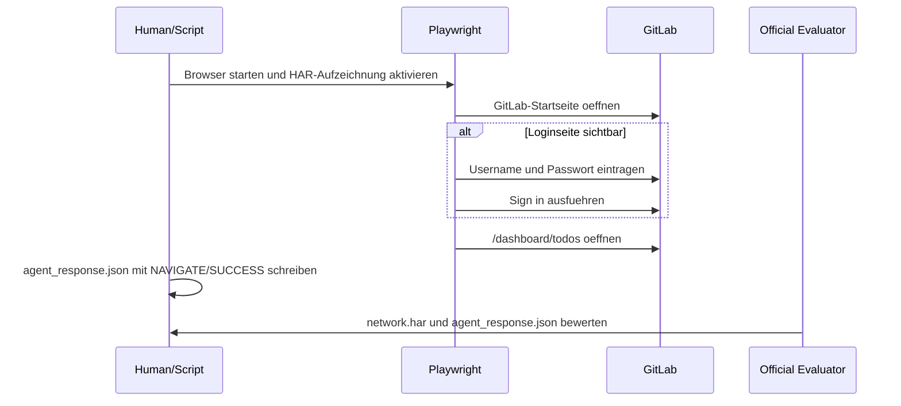
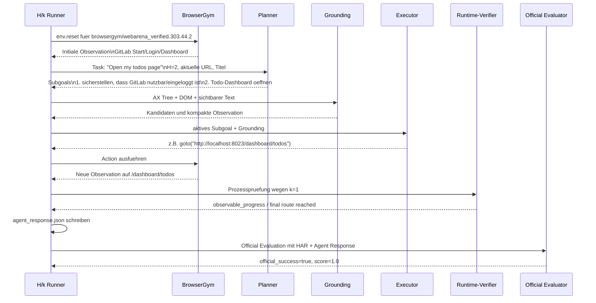

# Architektur und Umsetzung des H/k-Agents

Dieses Dokument beschreibt die praktische Umsetzung der H/k-Agentenarchitektur
fuer WebArena-Verified ueber BrowserGym. Es ist als ausfuehrliche Grundlage fuer
das Kapitel

```latex
\chapter{Architektur und Umsetzung}
\label{chap:architektur-umsetzung}
```

gedacht. Der Text beschreibt die tatsaechliche Implementierung im Repository und
grenzt sie vom urspruenglichen Plan-and-Act-Code ab: Plan-and-Act dient als
konzeptioneller Hintergrund fuer die Trennung von Planung und Ausfuehrung, fuer
Planhistorie/Replanning und fuer die Reduktion des HTML-/Observation-Rauschens.
Die eigentliche Experimentarchitektur ist jedoch die eigene H/k-Pipeline unter
`scripts/hk_agent/`.

## Ueberblick

Die Implementierung fuehrt Webaufgaben aus WebArena-Verified mit einer
Planner-Executor-Architektur aus. Jeder Lauf wird durch einen Task, einen
Planungshorizont `H`, ein Kontrollintervall `k`, eine Agentenarchitektur und eine
Modellkonfiguration bestimmt. Die Webinteraktion erfolgt ueber BrowserGym und
Playwright. Die LLM-Aufrufe laufen in der Google-only-Konfiguration nicht ueber
lokale Ollama-Modelle, sondern ueber einen lokalen Ollama-kompatiblen Proxy, der
die Anfragen an Google Vertex AI MaaS weiterleitet.

Die zentrale Idee ist:

- Der Planner plant abstrakte Subgoals.
- Der Executor setzt jeweils ein Subgoal in genau eine BrowserGym-Aktion um.
- Das Grounding reduziert die aktuelle Webseite auf relevante interaktive
  Elemente, Textausschnitte und bereinigte HTML-Fragmente.
- Der Runtime-Verifier bewertet waehrend des Laufs nur Prozesssignale.
- Der offizielle WebArena-Verified-Evaluator bestimmt nach dem Lauf den
  Benchmark-Erfolg.

Die experimentellen Parameter `H` und `k` veraendern nicht den Benchmark selbst,
sondern die Art, wie der Agent plant und kontrolliert wird:

| Parameter | Bedeutung in der Implementierung |
|---|---|
| `H` / `--hs` | Planungshorizont. Der Planner erzeugt je Planner-Aufruf hoechstens diesen Planungsausschnitt bzw. eine entsprechende Menge an Subgoals. |
| `k` / `--ks` | Kontrollintervall. Nach jeweils `k` Executor-Schritten wird der Runtime-Verifier aktiviert. |
| `T_{h,\kappa}` | Treatment-Kombination aus Planungshorizont und Kontrollintervall. |

## Zielbild der Architektur



# Anforderungen und Umsetzungsabgrenzung

Die Implementierung verfolgt mehrere Anforderungen gleichzeitig. Erstens muss
die Agentenarchitektur kontrolliert veraenderbar sein, damit unterschiedliche
`H/k`-Treatments vergleichbar bleiben. Zweitens muss die Ausfuehrung auf
WebArena-Verified reproduzierbar sein. Drittens duerfen Planner und Executor im
regulaeren Agentenmodus keine Oracle- oder Evaluatorinformationen erhalten.
Viertens muessen die waehrend der Laufzeit entstehenden Prozessdaten so
protokolliert werden, dass spaeter Erfolgs-, Effizienz- und Prozessmetriken
berechnet werden koennen.

Die Umsetzung ist deshalb bewusst modular:

| Anforderung | Umsetzung |
|---|---|
| Vergleichbare H/k-Treatments | `scripts/run_hk_agent_experiment.py` erzeugt Kombinationen aus `--hs` und `--ks`. |
| Saubere Taskbasis | `hk_agent.task_loader` laedt WebArena-Verified-Dataset und Hard-Subset. |
| Keine Gold-Information im Agentenmodus | `sanitize_task_for_agent(...)` entfernt Eval-/Oracle-Felder vor Planner-/Executor-Aufrufen. |
| Kontrollierte Webinteraktion | BrowserGym stellt die Action-Schnittstelle bereit; Playwright fuehrt Aktionen im Browser aus. |
| Rauschreduktion im Webzustand | `hk_agent.grounding` extrahiert Kandidaten, bereinigt HTML und begrenzt Texte. |
| Laufzeitkontrolle | Runtime-Verifier und Controller erzeugen Replanning- oder Abbruchentscheidungen. |
| Offizielle Erfolgsbestimmung | WebArena-Verified `eval-tasks` laeuft nachgelagert mit HAR und Agent Response. |
| Reproduzierbare Auswertung | Run-Verzeichnisse, JSONL-Traces, `summary.json` und `summary.csv`. |

Wichtig ist die Abgrenzung zum urspruenglichen Plan-and-Act-Repository unter
`plan_and_act/`. Dieses Repository enthaelt eine Referenzimplementierung fuer
Plan-and-Act mit eigenem Runner, eigener Promptlogik und eigenen CLI-Flags wie
`--actor_ip`, `--planner_ip`, `--cot_actor_model` und
`--cot_planner_model`. Fuer die finalen H/k-Experimente wird dieser Runner nicht
direkt als Haupt-Entry-Point verwendet. Stattdessen wird die Idee uebernommen,
einen Planner und einen Executor explizit zu trennen und dem Executor eine
bereinigte, handlungsnahe Seitenrepraesentation zu geben.

Die eigene Architektur erweitert dieses Prinzip um:

- explizite `H/k`-Treatments,
- BrowserGym/WebArena-Verified-spezifisches Action-Grounding,
- runtime-basierte Fortschrittspruefung,
- optionale Repair-Informationen bei PlanAct-aehnlichen Architekturen,
- strukturierte Artefakte fuer statistische Auswertung,
- Google-Vertex-Ausfuehrung ueber einen Ollama-kompatiblen Proxy.

Damit ist die Implementierung nicht als unveraenderte Kopie von Plan-and-Act zu
verstehen, sondern als H/k-Agent, der zentrale Plan-and-Act-Entwurfsentscheidungen
in eine eigene WebArena-Verified-Experimentpipeline uebertraegt.

# Gesamtarchitektur

Die Gesamtarchitektur besteht aus fuenf Schichten:

1. Experimentsteuerung.
2. Agentenlogik.
3. Browser- und Benchmark-Integration.
4. Modellanbindung.
5. Logging und Auswertung.



Der Lauf beginnt in `scripts/run_hk_agent_experiment.py`. Dort werden
Experimentname, Taskauswahl, `H/k`-Kombinationen, Step-Budgets,
Planner-Call-Budgets, Modellnamen, Agentenarchitektur und Resume-Verhalten
konfiguriert. Fuer jede Kombination ruft die Experimentsteuerung
`hk_agent.runner.run_hk_task(...)` auf.

Der Single-Run-Runner erzeugt zunaechst eine BrowserGym-Umgebung anhand der
WebArena-Verified-Gym-ID. Danach wird der Browser zur Startseite des jeweiligen
Tasks zurueckgesetzt. Aus dieser Initialobservation erzeugt der Planner einen
Plan. Anschliessend arbeitet der Executor die Subgoals ab, indem er jeweils eine
konkrete BrowserGym-Aktion erzeugt. Nach Action-Ausfuehrung entstehen neue
Observationen, die wiederum fuer den naechsten Executor-Schritt oder fuer ein
Replanning verwendet werden.

Der offizielle Benchmark-Erfolg wird nicht durch den Runtime-Verifier bestimmt.
Nach dem Agentenlauf werden `agent_response.json`, `network.har` und eine lokale
WebArena-Verified-Konfiguration an den offiziellen Evaluator uebergeben. Erst
dessen Ergebnis wird als `official_success` und `official_score` in den
Summaries gespeichert.

# Agentenkomponenten

Die Agentenkomponenten sind Planner, Executor, Runtime-Verifier, Controller und
optional eine Repair-Komponente. Gemeinsam bilden sie die H/k-Schleife.

## Planner-Komponente

Der Planner erzeugt keine Browseraktionen. Seine Aufgabe ist es, den Task in
Subgoals zu zerlegen. Die Implementierung nutzt `webarena_exp.planner.build_plan`
und uebergibt dafuer einen `PlannerRequest`. Der Request enthaelt unter anderem:

- den sanitisierten Task,
- die primaere Webanwendung,
- den Planungshorizont `h`,
- eine kompakte Observation fuer den Planner,
- den vorherigen Plan, falls ein Replan stattfindet,
- das letzte Runtime-Verifier-Signal,
- die letzte Controller-Entscheidung,
- bei PlanAct-aehnlichen Architekturen die Planhistorie und juengste Aktionen.

Die Planner-Observation ist absichtlich klein. Sie enthaelt nicht die komplette
Webseite, sondern typischerweise:

```text
current_url: ...
page_title: ...
last_action: ...
last_action_error: ...
last_runtime_evaluator_signal: ...
last_controller_decision: ...
```

Dadurch soll der Planner auf strategischer Ebene arbeiten: Welche groben
Zwischenschritte sind fuer die Aufgabe sinnvoll? Welche Richtung ist nach einem
Fehler oder No-Progress-Signal plausibel? Welche Subgoals sollen innerhalb des
Horizonts `H` als naechstes verfolgt werden?

Bei `H = 0` kann der Planner einen vollstaendigeren Plan erzeugen. Bei
`H > 0` wird der Planungsausschnitt begrenzt. Dadurch laesst sich empirisch
untersuchen, ob kuerzere oder laengere Planungsfenster fuer WebArena-Verified
vorteilhaft sind.

## Executor-Komponente

Der Executor uebersetzt ein aktives Subgoal in genau eine BrowserGym-kompatible
Aktion. Er verwendet `hk_agent.executor.BrowserGymLLMExecutor`. Anders als der
Planner bekommt der Executor eine deutlich staerker geerdete Sicht auf die
aktuelle Webseite.

Der Executor-Kontext besteht aus:

- dem sanitisierten Task-Intent,
- Tasktyp und Capability-Hinweisen,
- dem aktuell aktiven Subgoal,
- URL und Seitentitel,
- einem sichtbaren Textauszug,
- einer reduzierten Accessibility-/DOM-Sicht,
- aktuellen interaktiven Kandidaten,
- gekuerzten HTML-Fragmenten relevanter Kandidaten,
- sichtbaren Links,
- bisherigen Schritten,
- bei Repair-Architekturen einem Repair-Brief.

Die wichtigste Schnittstelle ist die Action-Ausgabe. Der Executor soll kein
freies Selenium- oder Playwright-Programm schreiben, sondern genau eine
BrowserGym-Action als JSON liefern. Typische Aktionen sind:

```text
goto("http://localhost:8023/...")
click("42")
fill("17", "Suchtext")
press("17", "Enter")
select_option("21", "Pending")
scroll(0, 600)
noop(1000)
send_msg_to_user("{...}")
```

Die Zahlen oder IDs in `click`, `fill`, `press` und `select_option` sind
BrowserGym- bzw. DOM-`bid`s. Der Executor soll also nicht `click("Search")`
oder `click("#search")` ausgeben, sondern auf ein aktuell sichtbares Element
verweisen. Diese Begrenzung reduziert Halluzinationen und macht die Aktion
pruefbar.

Die Executor-Implementierung enthaelt zusaetzlich Normalisierungen fuer
haeufige Modellabweichungen. Wenn ein Modell statt einer Action-Zeichenkette ein
strukturiertes JSON wie `{"action_type": "click", "target": "42"}` ausgibt,
kann dies in die erwartete BrowserGym-Syntax ueberfuehrt werden. Aehnlich werden
haeufige Varianten von `scroll(...)`, `finish(...)` oder finalen
WebArena-Antworten normalisiert. Diese Reparaturen fuegen keine
Gold-Information hinzu, sondern stabilisieren nur das Ausgabeformat.

## Runtime-Verifier

Der Runtime-Verifier ist eine laufzeitnahe Prozesskomponente. Er ist nicht der
offizielle Evaluator. Seine Aufgabe ist es, waehrend der Ausfuehrung Hinweise
auf Fortschritt, Fehler oder Stagnation zu erkennen.

Die Implementierung in `hk_agent.runtime_evaluator.evaluate_progress` nutzt
heuristische Signale:

- Veraenderung der URL,
- Veraenderung des Seitentitels,
- Aktionsfehler aus BrowserGym oder Playwright,
- 404-/Not-Found-Seiten,
- wiederholte URLs,
- `noop`-Aktionen,
- finale `send_msg_to_user(...)`-Aktionen.

Daraus werden unter anderem folgende Felder erzeugt:

| Feld | Bedeutung |
|---|---|
| `progress_score` | Grobe Prozessbewertung, nicht Benchmark-Erfolg. |
| `subgoal_done` | Ob aus Laufzeitsicht ein Zwischenschritt als abgeschlossen gelten kann. |
| `invalid_action` | Ob ein Aktionsfehler oder eine Fehlerseite erkannt wurde. |
| `no_progress` | Ob kein beobachtbarer Fortschritt vorliegt. |
| `loop_detected` | Ob wiederholte URL-Zustaende auf eine Schleife hindeuten. |
| `recommended_intervention` | Empfehlung, meist `continue` oder `local_replan`. |

Bei `k > 0` wird der Runtime-Verifier nach jeweils `k` Schritten aktiviert.
Zusatzlich wird er bei Fehlern oder beim Ende eines Laufs aufgerufen. Bei
`k = 0` ist die periodische Runtime-Validierung deaktiviert; dann entsteht eine
Baseline, in der Replanning deutlich eingeschraenkter ist.

## Repair-Komponente in v3-Varianten

Bei PlanAct-aehnlichen bzw. Repair-Architekturen kann der Runner zusaetzlich
Repair-Informationen erzeugen. Diese werden aus dem letzten Fehler, den letzten
Aktionen, dem aktuellen Seitenzustand, dem Runtime-Verifier-Signal und der
Controller-Entscheidung abgeleitet.

Der Repair-Brief dient dazu, den naechsten Planner- oder Executor-Aufruf nicht
nur mit "es ging schief" zu informieren, sondern mit einer kompakten
Fehlerklasse und einer konkreteren Reparaturrichtung. In Varianten wie
`v3_repair_brief` oder `v3_repair_llm` kann ein wiederholt gleicher,
nicht aufgeloester Repair-Fehler zum Abbruchgrund
`repeated_repair_failure:<failure_class>` fuehren.

Die in deinem Beispiel genutzte Architektur `--agent-architecture v3` ist
PlanAct-aehnlich, nutzt also Planhistorie, Grounding und striktere
Executor-Logik. Die noch expliziteren Repair-Brief-Varianten sind davon zu
unterscheiden.

# Controller und Replanning-Logik

Der Controller trifft aus dem Runtime-Verifier-Signal eine operative
Entscheidung. Die Entscheidung wird als strukturiertes Artefakt gespeichert und
fliesst beim naechsten Planner-Aufruf wieder in den Kontext ein.

Moegliche Entscheidungen sind:

| Entscheidung | Wirkung |
|---|---|
| `continue` | Der Agent arbeitet mit dem aktuellen Plan bzw. Subgoal weiter. |
| `local_replan` | Ein begrenztes Replanning wird angestossen. |
| `global_replan` | Der Planner soll den Plan umfassender neu ausrichten. |
| `abort` | Der Lauf wird mit Abbruchgrund beendet. |

Die zentrale H/k-Schleife im Runner laesst sich so lesen:

1. Planner erzeugt einen Plan.
2. Executor arbeitet Subgoals mit einzelnen Browseraktionen ab.
3. Nach `k` Schritten oder bei Fehlern bewertet der Runtime-Verifier den
   aktuellen Zustand.
4. Der Controller entscheidet, ob weitergemacht, neu geplant oder abgebrochen
   wird.
5. Bei Replanning erhaelt der Planner den vorherigen Plan, das Signal, die
   Controller-Entscheidung und die Planhistorie.



Ein Lauf endet damit, wenn einer der folgenden Faelle eintritt:

- der Agent eine regulaere Abschlussantwort erzeugt,
- bei NAVIGATE-Aufgaben eine sichtbare Zielerfuellung automatisch als finaler
  Navigationsabschluss erkannt wird,
- das tasktypabhaengige Step-Budget ausgeschoepft ist,
- das Planner-Call-Budget ausgeschoepft ist,
- eine Controller-Entscheidung `abort` lautet,
- wiederholte LLM-Timeouts oder wiederholte nicht aufgeloeste Repair-Fehler
  auftreten,
- ein technischer Fehler die Ausfuehrung nicht sinnvoll fortsetzen laesst.

Wichtig fuer die Auswertung: Eine vom Runtime-Verifier erkannte Schleife ist
nicht automatisch identisch mit dem finalen Benchmark-Misserfolg. Sie ist
zunaechst ein Prozesssignal. Sie kann zu Replanning fuehren, in den Artefakten
gezaehlt werden oder bei wiederholter Nichtbehebung indirekt zum Abbruch bzw.
Budgetverbrauch beitragen.

# BrowserGym- und WebArena-Verified-Integration

## Taskauswahl und BrowserGym-ID

Die Aufgaben stammen aus WebArena-Verified. Der Task Loader liest das Dataset
und optional das Hard-Subset. Aus den Taskfeldern wird eine BrowserGym-ID im
Schema

```text
browsergym/webarena_verified.<intent_template_id>.<task_id>.<revision>
```

gebildet. Diese ID wird an `gym.make(...)` uebergeben. BrowserGym uebernimmt
dann das Starten der passenden Umgebung, den Login in die jeweilige Site und die
Rueckgabe von Observationen.

Im regulaeren `agent`-Modus wird der Task vor Planner und Executor
sanitisiert. Dadurch werden insbesondere Evaluator-, Oracle-, Gold- und
Reference-Felder entfernt. Fuer die offizielle Evaluation bleibt der rohe Task
weiterhin vorhanden, wird aber nicht als Loesungshilfe an den Agenten gegeben.

## Observation- und Action-Schnittstelle

BrowserGym liefert nach `env.reset()` und nach jeder `env.step(action)` eine
Observation. Fuer die H/k-Architektur sind besonders relevant:

- aktuelle URL,
- Seitentitel ueber Playwright,
- sichtbarer Body-Text,
- Accessibility Tree,
- letzte Aktion,
- letzter Aktionsfehler,
- Netzwerkaufzeichnung ueber HAR.

Die Action-Schnittstelle bleibt BrowserGym-kompatibel. Der Executor erzeugt eine
Action-Zeichenkette, der Runner validiert und normalisiert diese, und BrowserGym
fuehrt sie im Browser aus.

Beispiel:

```text
click("42")
fill("17", "x-lab")
press("17", "Enter")
goto("http://localhost:8023/groups/example")
send_msg_to_user("{\"task_type\":\"RETRIEVE\",\"status\":\"SUCCESS\",\"retrieved_data\":[\"...\"]}")
```

Dadurch bleibt die Agentenarchitektur vom konkreten Browser getrennt:

- Der Executor entscheidet semantisch, welche Aktion als naechstes sinnvoll ist.
- BrowserGym/Playwright fuehrt die Aktion technisch aus.
- Der Runtime-Verifier bewertet Prozesssignale.
- Der Official Evaluator bestimmt den finalen Benchmark-Status.

## Benchmark-Evaluator und Erfolgsbestimmung

Der offizielle Erfolg eines Tasks wird nach dem Agentenlauf bestimmt. Dafuer
schreibt der Runner eine WebArena-Verified-kompatible `agent_response.json` und
zeichnet den Browserlauf als `network.har` auf. Anschliessend ruft
`hk_agent.official_evaluator` den WebArena-Verified-Evaluator auf.

Je nach Tasktyp bewertet WebArena-Verified unterschiedliche Evidenz:

- bei `NAVIGATE` die erreichte Seite bzw. URL,
- bei `RETRIEVE` die strukturierte Agentenantwort,
- bei `MUTATE` Netzwerkereignisse und/oder finalen Agentenstatus,
- bei Policy- oder kombinierten Tasks entsprechend die im Task definierte
  Evaluatorlogik.

Das Ergebnis wird in `eval_result.json` gespeichert und in die Run-Summary
uebernommen:

| Summary-Feld | Bedeutung |
|---|---|
| `official_score` | Score aus dem offiziellen Evaluator. |
| `official_success` | Binaere Erfolgsvariable fuer die Hauptauswertung. |
| `official_eval_status` | Status der offiziellen Evaluation. |
| `official_eval_returncode` | Returncode des Evaluator-Aufrufs. |

Damit bleibt die wissenschaftliche Trennung klar: Der Runtime-Verifier dient der
Steuerung des Agenten, der Official Evaluator dient der Bewertung des
Benchmarkerfolgs.

## Reset und Zustandsverwaltung

WebArena-Verified enthaelt zustandsbehaftete Webanwendungen. Besonders
MUTATE-Aufgaben koennen Spuren hinterlassen, etwa erstellte Issues,
geaenderte Produkte, neue Gruppen oder veränderte Einstellungen. Damit solche
Seiteneffekte nicht unkontrolliert in nachfolgende Laeufe hineinwirken, kann die
Experimentsteuerung vor MUTATE-Runs die betroffene Site neu starten.

Der Flag dafuer ist:

```text
--reset-site-before-mutate
```

Die Implementierung unterstuetzt insbesondere:

| Site | Container / Zweck |
|---|---|
| `gitlab` | GitLab-Aufgaben, z. B. Projekte, Issues, Gruppen, Commits. |
| `shopping` | Storefront-Aufgaben. |
| `shopping_admin` | Admin-/Magento-Aufgaben. |
| `reddit` | Forum-/Postmill-Aufgaben. |

Nach dem Neustart wird die Erreichbarkeit der Site ueber eine Readiness-Pruefung
kontrolliert. Fuer GitLab ist zusaetzlich eine Settling-Zeit vorgesehen, weil
der Dienst nach Containerstart laenger braucht, bis Login und UI stabil sind.

# Rauschreduktion der HTML- und DOM-Observation

Die Reduktion des HTML-Rauschens ist ein zentraler Teil der Umsetzung. Moderne
Webseiten enthalten sehr grosse DOM-Baeume, Skripte, Styles, Tracking-Elemente,
versteckte Controls, Layoutcontainer und wiederholte Navigationselemente. Ein
vollstaendiger HTML-Dump waere fuer ein LLM teuer, schwer zu verarbeiten und
oft kontraproduktiv. Die Implementierung reduziert deshalb die Seite auf eine
handlungsnahe Repraesentation.

## Quellen fuer das Grounding

`hk_agent.grounding` kombiniert zwei Quellen:

1. den Accessibility Tree aus BrowserGym,
2. den Live DOM der aktuellen Playwright-Seite.

Aus dem Accessibility Tree werden `bid`, Rolle und Name extrahiert. Aus dem DOM
werden sichtbare Elemente wie Links, Buttons, Inputs, Textareas, Selects,
Dialogelemente, Editor-Controls und interaktive ARIA-Rollen gelesen. Anschliessend
werden beide Quellen nach `bid` zusammengefuehrt.



## Inhalt eines Grounded Candidate

Ein `GroundedCandidate` enthaelt, sofern vorhanden:

| Feld | Zweck |
|---|---|
| `bid` | Aktuelle BrowserGym-Ziel-ID fuer Aktionen. |
| `role` / `tag` | Semantischer Elementtyp, z. B. Button, Link, Input. |
| `text` | Sichtbarer Text des Elements. |
| `href` | Zieladresse bei Links. |
| `placeholder`, `aria_label`, `name`, `value` | Formular- und Accessibility-Kontext. |
| `context` | Label-, Dialog-, Tabellenzeilen-, Formular-, Section- und Parent-Kontext. |
| `html` | Bereinigter, gekuerzter HTML-Ausschnitt. |
| `source` | Quelle, z. B. `dom`, `ax` oder `dom+ax`. |

Die Kandidaten werden nicht blind in DOM-Reihenfolge uebergeben. Sie werden
tasklokal gerankt. Dafuer werden Woerter aus Task-Intent und aktivem Subgoal
genutzt. Zusaetzlich werden interaktive Rollen, Formularfelder, Links,
Modal-Kontext und sitespezifische Hinweise gewichtet. Diese Heuristik verwendet
keine Evaluator- oder Goldinformationen, sondern nur sichtbare
Task-/Seiteninformationen.

## Bereinigung von HTML-Fragmenten

Die Funktion `clean_html_fragment(...)` entfernt oder begrenzt:

- `script`,
- `style`,
- `noscript`,
- `footer`,
- HTML-Kommentare,
- irrelevante Attribute,
- leere oder rein layoutbezogene Wrapper,
- ueberlange Textbereiche.

Erhalten bleiben nur Attribute, die fuer Interaktion und Interpretation nuetzlich
sind, etwa:

```text
id, data-label-id, bid, href, role, title, type, name, value,
placeholder, aria-label, aria-expanded, aria-selected, contenteditable
```

Damit bekommt der Executor keine rohe Webseite, sondern eine stark verdichtete
Sicht auf die fuer den naechsten Schritt relevanten Elemente. Das reduziert:

- Tokenkosten,
- Kontextueberladung,
- Halluzinationen durch irrelevante HTML-Details,
- falsche Klickziele,
- Kontextlimit-Probleme bei grossen DOM-Baeumen.

## Modal-, Formular- und Editor-Kontext

Ein wichtiger praktischer Punkt sind Dialoge, Tabellen und Code-Editoren.
Gerade GitLab- und Shopping-Admin-Aufgaben enthalten Modals, Grids, Filter,
Dropdowns und Editor-Komponenten. Die Grounding-Logik fuegt deshalb Kontext wie
`inside_modal`, `background_while_modal_visible`, Tabellenzeilentext,
Formulartext und Editor-Hinweise hinzu.

Dadurch kann der Executor beispielsweise unterscheiden, ob ein Button im aktiven
Modal liegt oder ob er im Hintergrund durch ein Overlay blockiert waere. Ebenso
kann ein Code-Editor als editorartiges Eingabefeld erkannt werden, auch wenn er
nicht als klassisches `<textarea>` erscheint.

# Prompting und strukturierte Ausgaben

Planner und Executor werden ueber getrennte Prompts gesteuert. Die
Planner-Prompts liegen unter:

```text
prompts/v3/planner_system.md
prompts/v3/prompt_user_template.md
```

Der Executor nutzt:

```text
prompts/v3/executor_system.md
prompts/v3/executor_base.md
prompts/v3/sites/<site>.md
prompts/v3/sites/<site>_<capability_tier>.md
```

Bei `v3` wird der Executor-Systemprompt aus dem offiziellen WebArena-Verified-
Basisvertrag, den v3-Executor-Regeln und dem passenden Site- bzw.
Mutation-Kontext zusammengesetzt. Zusaetzlich wird der Executor-Prompt um
aktuelle Grounding-Daten erweitert. Das Modell soll als Antwort ein
strukturiertes JSON mit Action, Action-Typ, Begruendung und erwarteter
Beobachtung liefern. Die Implementierung extrahiert daraus die BrowserGym-Aktion
und speichert die Rohantwort sowie Tokeninformationen.

Wichtig ist die Rollenverteilung:

- Der Planner erklaert die Strategie in Subgoals.
- Der Executor erzeugt genau den naechsten Schritt.
- Der Runtime-Verifier gibt kein offizielles Erfolgssignal, sondern
  Prozessfeedback.
- Der Official Evaluator bewertet final gegen WebArena-Verified.

Die Prompts werden im Google-only-Setup nicht direkt an lokale Modelle
geschickt. Der Runner sendet sie an eine Ollama-kompatible `/api/chat`-Route.
Der Proxy uebersetzt die Chat-Messages in Vertex-AI-`generateContent`-Requests.

# Plan-and-Act als Hintergrund der Umsetzung

Das Verzeichnis `plan_and_act/` enthaelt die externe Plan-and-Act-Codebasis.
Dort sind zwei Runner relevant:

| Datei | Rolle in der Referenz |
|---|---|
| `plan_and_act/run_plan_and_act.py` | Plan-and-Act-Ausfuehrung mit vorgegebenen bzw. erzeugten Plaenen. |
| `plan_and_act/run_plan_and_act_with_replanning.py` | Variante mit Replanning-Logik und Planhistorie. |

Die Referenzarchitektur arbeitet ebenfalls mit einer Trennung von Planner und
Actor/Executor. Sie nutzt CLI-Parameter wie:

```text
--actor_ip
--planner_ip
--cot_actor_model
--cot_planner_model
--observation_type
--max_obs_length
--max_steps
```

Fuer die H/k-Experimente wurde diese Struktur nicht unveraendert uebernommen.
Stattdessen wurden die Konzepte in eine BrowserGym/WebArena-Verified-spezifische
Pipeline ueberfuehrt:

| Plan-and-Act-Idee | Umsetzung im H/k-Agent |
|---|---|
| Expliziter Planner | `webarena_exp.planner.build_plan` mit `PlannerRequest`. |
| Executor/Actor fuer konkrete Aktionen | `hk_agent.executor.BrowserGymLLMExecutor`. |
| Planhistorie | `plan_history.json` bei PlanAct-aehnlichen Architekturen. |
| Replanning | Runtime-Verifier + Controller + erneuter Planner-Aufruf. |
| Observation-Kuerzung | `hk_agent.grounding` mit Candidate-Auswahl und HTML-Cleaning. |
| Webaktionsbindung | BrowserGym-Action-Strings mit aktuellen `bid`s. |

Damit dient Plan-and-Act als methodischer Hintergrund, waehrend die eigentliche
Implementierung die H/k-Fragestellung operationalisiert.

# Experimentsteuerung, Logging und Messdatenerfassung

Die Experimentsteuerung liegt in:

```text
scripts/run_hk_agent_experiment.py
```

Sie prueft die Laufzeitumgebung, waehlt Tasks aus, erzeugt `H/k`-Kombinationen,
setzt Budgets, startet optionale Site-Resets und schreibt experimentweite
Summaries.

Ein einzelner Run schreibt in ein Verzeichnis der Form:

```text
runs/hk-agent/<experiment-name>/<site>/<task_id>/h<H>_k<k>/<task_id>/
```

Wichtige Run-Artefakte:

| Artefakt | Inhalt |
|---|---|
| `run_summary.json` | Zentrale Zusammenfassung des Runs. |
| `diagnostic.json` | Diagnostische Einordnung des Laufs. |
| `plan.json` | Zuletzt erzeugter Plan. |
| `plan_history.json` | Planversionen, Runtime-Feedback und Repair-Kontext bei PlanAct-aehnlichen Architekturen. |
| `step_trace.jsonl` | BrowserGym-Schritte, Aktionen, URLs, Status und Fehler. |
| `runtime_evaluator_signals.jsonl` | Prozesssignale des Runtime-Verifiers. |
| `controller_decisions.jsonl` | Entscheidungen des Controllers. |
| `planner_calls.jsonl` | Planner-Aufrufe, Tokenzahlen, Latenz, Modellname und Antwortvorschau. |
| `executor_calls.jsonl` | Executor-Aufrufe, Actions, Tokenzahlen, Latenz, Begruendung und Grounding-Referenzen. |
| `executor_prompts/` | Prompt-Snapshots pro Executor-Call. |
| `executor_grounding/` | Grounding-Snapshots pro Executor-Call. |
| `agent_response.json` | WebArena-Verified-kompatible finale Agentenantwort. |
| `network.har` | Netzwerkaufzeichnung des Browserlaufs. |
| `config.webarena_verified.local.json` | Lokale Evaluator-Konfiguration. |
| `eval_result.json` | Ergebnis des offiziellen WebArena-Verified-Evaluators. |

Experimentweite Artefakte:

| Artefakt | Inhalt |
|---|---|
| `experiment_config.json` | Konfiguration des gesamten Experiments. |
| `selected_tasks.json` | Ausgewaehlte Tasks. |
| `summary.json` | Alle Runs als strukturierte JSON-Liste. |
| `summary.csv` | Tabellarische Zusammenfassung fuer Notebooks. |
| `diagnostics_summary.json` | Aggregierte Diagnostik, sofern erzeugt. |

Die Summary enthaelt unter anderem:

- `task_id`,
- `intent_template_id`,
- `revision`,
- `gym_id`,
- `site`,
- `task_type`,
- `task_capability`,
- `capability_tier`,
- `h`,
- `k`,
- `run_mode`,
- `planner_model`,
- `executor_model`,
- `agent_architecture`,
- `started_at`,
- `ended_at`,
- `phase_durations_ms`,
- `total_runtime_ms`,
- `total_steps`,
- `planner_calls`,
- `executor_calls`,
- `prompt_tokens`,
- `completion_tokens`,
- `planner_prompt_tokens`,
- `planner_completion_tokens`,
- `executor_prompt_tokens`,
- `executor_completion_tokens`,
- `runtime_replans`,
- `runtime_no_progress_events`,
- `runtime_invalid_actions`,
- `runtime_loop_events`,
- `abort_reason`,
- `official_score`,
- `official_success`,
- `official_eval_status`.

Diese Daten reichen aus, um Erfolgsmetriken, Effizienzmetriken und
Prozessmetriken aus den gespeicherten Artefakten zu berechnen. Der Begriff
"Run-ID" sollte in der Arbeit am besten als Run-Verzeichnis bzw. eindeutige
Kombination aus Experiment, Site, Task-ID und Treatment definiert werden, da
nicht zwingend ein separates Feld `run_id` existiert.

# Google-Only Modellanbindung

Im Google-only-Setup laufen keine lokalen Ollama-Modelle. Lokal laeuft nur ein
Proxy:

```text
scripts/vertex_ollama_proxy.py
```

Dieser Proxy implementiert die fuer den Runner benoetigte Ollama-kompatible
Route:

```text
POST /api/chat
```

Intern wandelt er die Ollama-Chat-Nachricht in einen Vertex-AI-Request um:



Der Runner kann weiterhin Modellnamen wie `gemma4:26b` und `gemma4:e4b`
loggen. Wenn der Proxy mit `--force-default-model` gestartet wird, werden beide
eingehenden Namen auf das konfigurierte Vertex-MaaS-Modell geroutet, zum
Beispiel:

```text
gemma-4-26b-a4b-it-maas
```

Dadurch bleiben bestehende Runner-Flags kompatibel, waehrend die eigentliche
Inferenz in Google Cloud stattfindet.

## Proxy starten

Vor dem Experiment muessen Google Application Default Credentials und die
Projektvariablen gesetzt sein:

```bash
gcloud auth application-default login
export GOOGLE_CLOUD_PROJECT="<dein-google-cloud-project>"
export GOOGLE_CLOUD_LOCATION="global"
export VERTEX_MAAS_PUBLISHER="google"
export VERTEX_MAAS_MODEL="gemma-4-26b-a4b-it-maas"
```

Dann wird der Proxy in einem eigenen Terminal gestartet:

```bash
uv run python scripts/vertex_ollama_proxy.py \
  --host 127.0.0.1 \
  --port 11435 \
  --project-id "$GOOGLE_CLOUD_PROJECT" \
  --location "$GOOGLE_CLOUD_LOCATION" \
  --publisher "$VERTEX_MAAS_PUBLISHER" \
  --model "$VERTEX_MAAS_MODEL" \
  --force-default-model \
  --timeout-seconds 600
```

Der Runner wird anschliessend mit

```text
--ollama-base-url http://127.0.0.1:11435
```

gestartet. Dieser Parameter bedeutet in diesem Setup also nicht "lokale Ollama
Inferenz", sondern "Ollama-kompatibler Zugriff auf Vertex AI".

# Beispielaufruf fuer Task 550

Das von dir genutzte Beispiel fuer einen einzelnen Task mit `H=5` und `k=10`
lautet in der Google-only-Konfiguration:

```bash
uv run python scripts/run_hk_agent_experiment.py \
  --experiment-name hk-agent-browsergym-planact-main-v02_basis_v3 \
  --task-ids 550 \
  --hs 5 \
  --ks 10 \
  --run-mode agent \
  --planner-model gemma4:26b \
  --executor-model gemma4:e4b \
  --agent-architecture v3 \
  --max-steps-policy tiered \
  --max-steps-navigation 20 \
  --max-steps-retrieval 30 \
  --max-steps-policy-task 25 \
  --max-steps-mutation 50 \
  --max-planner-calls 0 \
  --planner-call-margin 2 \
  --max-steps 500 \
  --llm-timeout-seconds 600 \
  --max-consecutive-llm-timeouts 0 \
  --success-policy contamination_adjusted \
  --ollama-base-url http://127.0.0.1:11435 \
  --reset-site-before-mutate \
  --site-reset-timeout-seconds 300 \
  --resume-summary \
  --replace-requested-runs \
  --refresh-existing-diagnostics
```

Die wichtigsten Flags:

| Flag | Bedeutung |
|---|---|
| `--experiment-name` | Name des Experimentordners unter `runs/hk-agent/`. |
| `--task-ids 550` | Fuehrt genau Task 550 aus. |
| `--hs 5` | Setzt den Planungshorizont `H=5`. |
| `--ks 10` | Setzt das Kontrollintervall `k=10`. |
| `--run-mode agent` | Fairer Modus ohne Oracle-/Evaluatorinformationen fuer Planner/Executor. |
| `--planner-model gemma4:26b` | Logischer Modellname fuer den Planner. Bei Proxy-Betrieb wird er an Vertex weitergeleitet bzw. auf das Default-Modell gemappt. |
| `--executor-model gemma4:e4b` | Logischer Modellname fuer den Executor. |
| `--agent-architecture v3` | Nutzt die aktuelle PlanAct-aehnliche v3-Architektur. |
| `--max-steps-policy tiered` | Nutzt tasktypabhaengige Step-Budgets. |
| `--max-steps-navigation 20` | Budget fuer Navigationsaufgaben. |
| `--max-steps-retrieval 30` | Budget fuer Retrieval-Aufgaben. |
| `--max-steps-policy-task 25` | Budget fuer Policy-Aufgaben. |
| `--max-steps-mutation 50` | Budget fuer Mutationsaufgaben. |
| `--max-planner-calls 0` | Deaktiviert das Planner-Call-Budget. |
| `--planner-call-margin 2` | Puffer fuer dynamische Planner-Budgets, falls `auto` genutzt wird. |
| `--max-steps 500` | Globaler Fallback bzw. Sicherheitswert; bei `tiered` gelten die spezifischen Budgets. |
| `--llm-timeout-seconds 600` | Timeout pro LLM-Aufruf. |
| `--max-consecutive-llm-timeouts 0` | Kein separates wiederholtes Timeout-Budget; PlanAct-aehnliche Executor-Timeouts fuehren dadurch konservativ zum Abbruchgrund. |
| `--success-policy contamination_adjusted` | Nutzt eine angepasste Erfolgsinterpretation fuer bekannte Kontaminations-/Near-Miss-Faelle in der Diagnostik. |
| `--ollama-base-url http://127.0.0.1:11435` | Route zum Vertex-Ollama-Proxy. |
| `--reset-site-before-mutate` | Setzt zustandsveraendernde Sites vor MUTATE-Runs zurueck. |
| `--site-reset-timeout-seconds 300` | Maximale Wartezeit auf Readiness nach Site-Reset. |
| `--resume-summary` | Vorhandene Summary wird weiterverwendet. |
| `--replace-requested-runs` | Angeforderte Task/H/k-Kombinationen werden neu erzeugt. |
| `--refresh-existing-diagnostics` | Diagnostik wird aus bestehenden Artefakten aktualisiert. |

# Allgemeiner Experimentaufruf

Fuer mehrere Tasks und mehrere Treatments wird dieselbe CLI verwendet:

```bash
uv run python scripts/run_hk_agent_experiment.py \
  --experiment-name <experiment-name> \
  --task-ids <task-id-1> <task-id-2> <task-id-3> \
  --hs 0 2 5 \
  --ks 0 5 10 \
  --run-mode agent \
  --planner-model gemma4:26b \
  --executor-model gemma4:e4b \
  --agent-architecture v3 \
  --max-steps-policy tiered \
  --max-steps-navigation 20 \
  --max-steps-retrieval 30 \
  --max-steps-policy-task 25 \
  --max-steps-mutation 50 \
  --llm-timeout-seconds 600 \
  --success-policy contamination_adjusted \
  --ollama-base-url http://127.0.0.1:11435 \
  --reset-site-before-mutate \
  --resume-summary
```

Alternativ kann eine stratifizierte Taskauswahl ueber Sites und
Intent-Laengen-Buckets erfolgen, sofern die entsprechenden CLI-Flags genutzt
werden:

```bash
uv run python scripts/run_hk_agent_experiment.py \
  --experiment-name hk-agent-stratified-example \
  --sample-sites gitlab reddit shopping shopping_admin \
  --sample-buckets short medium long \
  --sample-seed 42 \
  --hs 0 2 5 \
  --ks 0 5 10 \
  --run-mode agent \
  --planner-model gemma4:26b \
  --executor-model gemma4:e4b \
  --agent-architecture v3 \
  --max-steps-policy tiered \
  --llm-timeout-seconds 600 \
  --ollama-base-url http://127.0.0.1:11435
```

# Beispielhafte Durchfuehrung: WebArena-Verified Task 44

Task 44 eignet sich als leicht verstaendliches Beispiel, weil er die
Grundmechanik der Architektur zeigt, ohne dass bereits komplexe Mutation,
Dateneingabe oder strukturierte Antwortextraktion notwendig ist. Der Task ist
eine GitLab-Navigationsaufgabe.

Die relevante Taskdefinition lautet sinngemaess:

```json
{
  "sites": ["gitlab"],
  "task_id": 44,
  "intent_template_id": 303,
  "start_urls": ["__GITLAB__"],
  "intent": "Open my todos page",
  "eval": [
    {
      "evaluator": "AgentResponseEvaluator",
      "expected": {
        "task_type": "NAVIGATE",
        "status": "SUCCESS",
        "retrieved_data": null,
        "error_details": null
      }
    },
    {
      "evaluator": "NetworkEventEvaluator",
      "expected": {
        "url": [
          "__GITLAB__/dashboard/todos",
          "__GITLAB__/dashboard/todos?state=pending"
        ],
        "http_method": "GET",
        "response_status": 200
      }
    }
  ],
  "revision": 2
}
```

Der natuerliche Sprachauftrag lautet also:

```text
Open my todos page
```

In der lokalen WebArena-Verified-Umgebung wird `__GITLAB__` durch die lokale
GitLab-Instanz ersetzt, typischerweise:

```text
http://localhost:8023
```

Das Ziel ist nicht, eine Information aus GitLab zu extrahieren oder einen
Zustand zu veraendern, sondern die richtige Seite aufzurufen. Der offizielle
Evaluator erwartet am Ende, dass der Browserlauf eine Anfrage auf eine der
folgenden Ziel-URLs enthaelt:

```text
http://localhost:8023/dashboard/todos
http://localhost:8023/dashboard/todos?state=pending
```

Zusätzlich muss die finale Agentenantwort den Task als erfolgreiche
Navigationsaufgabe markieren:

```json
{
  "task_type": "NAVIGATE",
  "status": "SUCCESS",
  "retrieved_data": null,
  "error_details": null
}
```

## Manuelle Loesung von Task 44

Wenn ein Mensch Task 44 manuell ausfuehrt, passiert im Kern Folgendes:

1. Die lokale GitLab-Webseite wird geoeffnet.
2. Falls GitLab noch nicht eingeloggt ist, meldet sich der Nutzer mit den
   Benchmark-Zugangsdaten an.
3. Nach dem Login navigiert der Nutzer zur eigenen Todo-Seite.
4. Diese Seite ist in GitLab ueber den Pfad `/dashboard/todos` erreichbar.
5. Sobald die Todo-Seite geladen ist, ist der Navigationsauftrag erfuellt.

Als manuelle URL ergibt sich damit:

```text
http://localhost:8023/dashboard/todos
```

Ein Mensch kann diesen Task also entweder ueber die GitLab-Oberflaeche loesen,
zum Beispiel ueber Dashboard- oder Todo-Navigation, oder direkt durch Eingabe
der Zieladresse im Browser. Fuer den Benchmark ist entscheidend, dass der
Browserlauf die erwartete Seite erreicht und dass die finale Agentenantwort
formal zum Tasktyp `NAVIGATE` passt.

## Umsetzung durch einen einfachen nicht-LLM-Runner

In den fruehen Implementierungsschritten wurde Task 44 als Sanity-Check genutzt.
Der minimale Runner loeste genau diesen Task deterministisch:

```text
scripts/archive/legacy_runners/run_gitlab_task44_navigate_runner.py
```

Der Ablauf war:



Diese fruehe Variante war bewusst kein autonomer Agent. Sie diente dazu, den
Artefaktvertrag zu pruefen:

- Wird ein `network.har` geschrieben?
- Wird eine gueltige `agent_response.json` geschrieben?
- Kann der offizielle WebArena-Verified-Evaluator den Lauf bewerten?
- Wird Task 44 bei korrekter Navigation mit `score = 1.0` bewertet?

Danach wurde dieselbe Aufgabe ueber BrowserGym geloest:

```text
scripts/archive/legacy_runners/run_browsergym_gitlab_task44_runner.py
```

Auch dort war die fachliche Loesung noch deterministisch: BrowserGym wurde
gestartet, GitLab wurde gegebenenfalls eingeloggt, dann wurde die BrowserGym
Action

```text
goto("http://localhost:8023/dashboard/todos")
```

ausgefuehrt. Dieser Schritt war wichtig, weil die spaetere H/k-Architektur
ebenfalls BrowserGym-Actions ausgibt.

## Umsetzung durch den H/k-Agenten

In der finaleren H/k-Architektur wird Task 44 nicht mehr durch einen
hartcodierten Task-44-Runner geloest. Stattdessen bekommt der Agent nur den
sanitisierten Taskauftrag:

```text
Open my todos page
```

Der Planner und Executor muessen daraus selbst eine Ausfuehrungsstrategie
ableiten. Fuer Task 44 koennte der Ablauf mit `H=2` und `k=1` beispielsweise so
aussehen:



Die Plan-and-Act-Idee wird hier sichtbar: Der Planner zerlegt die Aufgabe in
einen kleinen Plan, waehrend der Executor die konkrete Browseraktion auswaehlt.
Bei Task 44 ist der Plan sehr kurz, weil die Aufgabe nur Navigation verlangt.
Bei komplexeren GitLab-Aufgaben wuerde der Planner mehr Subgoals erzeugen, etwa
"Projekt oeffnen", "Issues-Seite aufrufen", "Filter setzen" oder "Eintrag
auswaehlen".

Ein plausibler Planner-Output fuer Task 44 waere:

```json
{
  "subgoals": [
    {
      "id": "sg1",
      "objective": "Open GitLab and ensure the user is authenticated.",
      "expected_outcome": "The GitLab dashboard or another authenticated GitLab page is visible."
    },
    {
      "id": "sg2",
      "objective": "Navigate to the user's todos page.",
      "expected_outcome": "The browser is on the GitLab todos dashboard."
    }
  ]
}
```

Ein plausibler Executor-Schritt fuer das zweite Subgoal waere:

```json
{
  "action_type": "goto",
  "action": "goto(\"http://localhost:8023/dashboard/todos\")",
  "rationale_summary": "The task asks to open the user's todos page; GitLab exposes it at /dashboard/todos.",
  "expected_observation": "The GitLab todos page is visible."
}
```

Wenn der Executor stattdessen ueber die UI navigiert, koennte er aktuelle
Grounding-Kandidaten verwenden, zum Beispiel einen Link oder Menueintrag mit
einem `bid`. Dann wuerde die Aktion eher so aussehen:

```text
click("42")
```

wobei `42` fuer ein aktuell sichtbares BrowserGym-Zielelement steht, das zur
Todo-Seite fuehrt. Der Vorteil dieser geerdeten Variante ist, dass der Executor
nicht einfach frei `click("Todos")` behauptet, sondern ein reales Element aus
der aktuellen Observation verwenden muss.

## Was bei Task 44 geloggt wird

Auch dieser einfache Task erzeugt die normalen Run-Artefakte:

| Artefakt | Beispielinhalt bei Task 44 |
|---|---|
| `step_trace.jsonl` | Reset, ausgefuehrte `goto`- oder `click`-Aktionen, URLs vor/nach der Aktion. |
| `planner_calls.jsonl` | Planner-Aufruf mit `H`, Modellname, Tokenzahlen und Planvorschau. |
| `executor_calls.jsonl` | Executor-Aufruf mit Action, Begruendung, Tokenzahlen und Latenz. |
| `runtime_evaluator_signals.jsonl` | Bei `k>0` Prozesssignal nach dem Schritt, z. B. beobachtbarer Fortschritt. |
| `controller_decisions.jsonl` | Entscheidung wie `continue` oder bei finalem Zustand Abschlusskontext. |
| `network.har` | Netzwerkereignisse, darunter der GET-Request auf `/dashboard/todos`. |
| `agent_response.json` | Finale WebArena-Verified-Antwort fuer `NAVIGATE/SUCCESS`. |
| `eval_result.json` | Offizielle Bewertung durch WebArena-Verified. |
| `run_summary.json` | Zusammenfassung mit `official_success`, Runtime, Tokens, Steps und Artefaktpfaden. |

Der offizielle Erfolg entsteht nicht dadurch, dass der Runtime-Verifier sagt
"Fortschritt erkannt", sondern dadurch, dass der WebArena-Verified-Evaluator
nachtraeglich zwei Bedingungen prueft:

1. Die Agentenantwort ist eine erfolgreiche Navigationsantwort.
2. Im HAR ist die erwartete Todo-URL als Netzwerkereignis enthalten.

## Vergleich mit einem allgemeineren Plan-and-Act-Beispiel

Das oft genutzte Beispiel

```text
Follow the top contributor of this GitHub project.
```

hat dieselbe Grundstruktur, ist aber fachlich komplexer. Dort muesste der
Planner die Aufgabe etwa zerlegen in:

1. Projektseite oeffnen.
2. Contributors-Bereich finden.
3. Top Contributor identifizieren.
4. Profil des Contributors oeffnen.
5. Follow-Aktion ausfuehren.

Bei Task 44 ist die entsprechende Zerlegung kuerzer:

1. GitLab oeffnen und gegebenenfalls authentifiziert sein.
2. Die eigene Todo-Seite oeffnen.
3. Navigationsabschluss melden.

Der didaktische Nutzen von Task 44 liegt also nicht in der Schwierigkeit,
sondern in der Klarheit: Man sieht an einem kleinen Beispiel, wie Task,
Planner-Subgoals, Executor-Action, BrowserGym-Ausfuehrung, HAR-Aufzeichnung und
offizielle Evaluation zusammenhaengen.

# Reproduzierbarkeit der Implementierung

Die Reproduzierbarkeit ergibt sich aus der Kombination von Codezustand,
Konfiguration, Taskauswahl, Run-Artefakten und externer Modellkonfiguration.
Fuer eine saubere Dokumentation sollten mindestens folgende Punkte festgehalten
werden:

- Repository-Commit oder Codeversion.
- Python-Version, mindestens Python 3.12 fuer BrowserGym/WebArena-Verified.
- Installationsweg, z. B. `uv`.
- WebArena-Verified-Version bzw. Submodule-/Repozustand unter
  `external/webarena-verified`.
- verwendetes Dataset und Hard-Subset.
- ausgewaehlte Task-IDs.
- `H/k`-Kombinationen.
- Agentenarchitektur, z. B. `v3`.
- Planner- und Executor-Modellnamen.
- Google-Vertex-Modell und Region.
- Step- und Planner-Call-Budgets.
- Timeout-Werte.
- Reset-Policy fuer MUTATE-Aufgaben.
- Erfolgspolitik, z. B. `contamination_adjusted`.
- Output-Verzeichnis des Experiments.

Praktisch werden viele dieser Angaben automatisch in `experiment_config.json`,
`selected_tasks.json`, `run_summary.json`, `summary.json` und `summary.csv`
gespeichert. Fuer die Arbeit ist wichtig, klar zu unterscheiden zwischen:

- Konfigurationsdaten: Was wurde ausgefuehrt?
- Trajektoriendaten: Was hat der Agent getan?
- Prozessdaten: Welche Runtime-Signale, Replans und Fehler traten auf?
- Evaluationsdaten: Wie hat WebArena-Verified den Lauf bewertet?

# Formulierungsvorschlag fuer die Thesis

Der folgende Text ist bewusst als wissenschaftlich vorsichtige Formulierung
geschrieben und kann in das Kapitel uebernommen bzw. gekuerzt werden.

```latex
\chapter{Architektur und Umsetzung}
\label{chap:architektur-umsetzung}

Die implementierte Agentenarchitektur kombiniert eine explizite
Planner-Executor-Trennung mit einer H/k-basierten Laufzeitkontrolle. Der
Planungshorizont \(H\) bestimmt, wie weit der Planner die Aufgabe in Subgoals
vorausstrukturiert. Das Kontrollintervall \(\kappa\) bestimmt, nach wie vielen
Executor-Schritten der aktuelle Laufzustand durch einen Runtime-Verifier
bewertet und gegebenenfalls ein Replanning angestossen wird. Die Architektur ist
von Plan-and-Act inspiriert, wird jedoch in einer eigenen
BrowserGym/WebArena-Verified-Pipeline umgesetzt.

Der Planner verarbeitet einen sanitisierten Taskkontext, den aktuellen
Browserzustand in kompakter Form, die bisherige Planhistorie sowie optionales
Feedback aus vorherigen Runtime-Pruefungen. Er erzeugt daraus eine strukturierte
Liste von Subgoals. Der Executor erhaelt jeweils ein aktives Subgoal und eine
aktuelle, geerdete Sicht auf die Webseite. Diese Sicht besteht nicht aus einem
vollstaendigen HTML-Dump, sondern aus einer reduzierten Kombination von
Accessibility-Tree, sichtbarem Text, interaktiven Kandidaten und gekuerzten
HTML-Fragmenten. Dadurch werden Kontextlaenge, HTML-Rauschen und die Gefahr
nicht existierender Aktionsziele reduziert.

Die Webinteraktion erfolgt ueber BrowserGym und Playwright. Der Executor gibt
pro Schritt genau eine BrowserGym-kompatible Aktion aus, beispielsweise
\texttt{click}, \texttt{fill}, \texttt{press}, \texttt{goto},
\texttt{scroll} oder \texttt{send\_msg\_to\_user}. UI-Aktionen werden nach
Moeglichkeit an aktuelle BrowserGym-\texttt{bid}s gebunden, sodass der Agent
nicht frei erfundene CSS-Selektoren oder rein textuelle Zielbeschreibungen
verwenden muss.

Der Runtime-Verifier bewertet waehrend des Laufs ausschliesslich Prozesssignale
wie URL-Aenderungen, Aktionsfehler, wiederholte Seitenzustaende oder fehlenden
beobachtbaren Fortschritt. Diese Signale dienen der Steuerung von Continue-,
Replanning- oder Abort-Entscheidungen und werden nicht als finaler
Benchmark-Erfolg interpretiert. Die Erfolgsbestimmung erfolgt nach Abschluss des
Agentenlaufs durch den offiziellen WebArena-Verified-Evaluator auf Basis der
gespeicherten Agentenantwort und der aufgezeichneten Netzwerkereignisse.

Fuer die Modellanbindung wird in der Google-only-Konfiguration ein lokaler
Ollama-kompatibler Proxy verwendet. Der Runner sendet Planner- und
Executor-Anfragen an \texttt{http://127.0.0.1:11435/api/chat}; der Proxy leitet
diese Anfragen an Google Vertex AI MaaS weiter. Lokal findet damit keine
Modellinferenz statt, waehrend die bestehende Runner-Schnittstelle
beibehalten werden kann.
```
