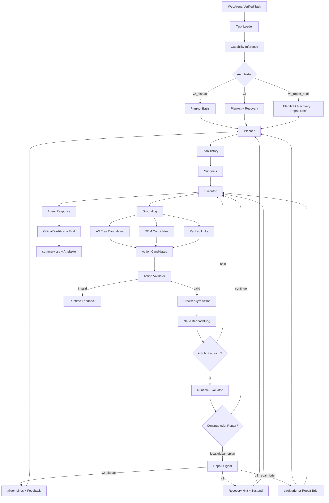
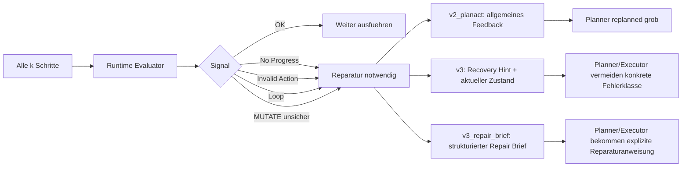

# Architekturvarianten: v2_planact, v3 und v3_repair_brief

Diese Notiz vergleicht die drei relevanten Architekturstaende der aktuellen
H/k-Agentenlinie. Der Fokus liegt auf der Frage, was die Varianten jeweils
zusaetzlich koennen und wie der `k`-Loop als Reparatur- und Kontrollschleife
gedacht ist.

## Kurzfazit

| Variante | Rolle | Staerke | Grenze |
|---|---|---|---|
| `v2_planact` | stabile Plan-and-Act-inspirierte Basis | Grounded Executor, aktuelle `bid`s, PlanHistory, dynamisches Replanning | k-Feedback ist eher allgemein; Reparatur bleibt grob |
| `v3` | verbesserte Reparaturarchitektur | nutzt k-Feedback, Recovery Hints und GitLab/MUTATE-Zustand staerker | Reparatur ist noch nicht als eigenes Briefing-Objekt verdichtet |
| `v3_repair_brief` | explorative Diagnosevariante | erzeugt strukturierte k-Reparaturbriefe fuer Planner und Executor | laengere Prompts, mehr Tokenkosten, bei GitLab-MUTATE noch nicht stabiler |

Fuer die Hauptauswertung ist aktuell `v2_planact` oder `v3` besser geeignet.
`v3_repair_brief` ist wertvoll als Forschungs-/Zwischenstand, weil es zeigt,
dass Fehlerdiagnose moeglich ist, aber dass die eigentliche Grenze oft im
Executor-Grounding liegt.

## Gemeinsame Grundlage

Alle drei Varianten behalten den WebArena-Verified-Vertrag bei:

- Die originalen WebArena-Verified Task-Prompts bleiben Grundlage.
- Der Planner gibt weiterhin `Plan` und `Subgoal` aus.
- Der Executor gibt weiterhin BrowserGym-kompatible Actions aus.
- Offizielle Bewertung erfolgt weiterhin ueber WebArena-Verified.
- H/k bleibt experimentell interpretierbar:
  - `h` steuert Planungs-/Horizontgrenzen.
  - `k` steuert, wann der aktuelle Laufzustand bewertet und ggf. repariert wird.

## Varianten im Vergleich

### `v2_planact`

`v2_planact` ist die konservative Erweiterung von `v2`. Die Idee ist nicht,
den alten Agenten zu ersetzen, sondern eine besser messbare Plan-and-Act-Spur
zu schaffen.

Zusaetzliche Faehigkeiten:

- Grounded Observation aus AX Tree, DOM und Link-Kandidaten.
- Aktuelle `action_candidates` mit `bid`, Rolle, Text, href, Placeholder und
  HTML-Kontext.
- Strenge Validierung: UI-Actions muessen aktuelle `bid`s nutzen.
- Ablehnung von CSS-Selektoren, sichtbaren Labels und geratenen BIDs.
- RETRIEVE-SUCCESS wird nur akzeptiert, wenn sichtbare Evidenz vorhanden ist.
- MUTATE-SUCCESS benoetigt eine echte vorherige Mutationsaktion.
- PlanHistory fuer Planner und dynamisches Replanning.

Einordnung:

`v2_planact` ist die sauberste Vergleichsbasis. Sie verbessert den Executor,
ohne zu viel neue Reparaturlogik einzufuehren.

### `v3`

`v3` baut auf `v2_planact` auf und macht den k-Loop staerker reparaturorientiert.
Das passt zu deiner Zielidee: k soll nicht nur "alle k Schritte mal schauen",
sondern aktiv pruefen, ob der Agent noch auf dem richtigen Pfad ist.

Zusaetzliche Faehigkeiten gegenueber `v2_planact`:

- staerkere Recovery Hints bei invaliden Actions, stale BIDs und no-progress
- MUTATE-spezifischer Zustand, z. B. ob Formular, Submit oder State-Check
  bereits passiert ist
- GitLab-spezifische Unterscheidung von Fork-Form, Invite-Modal, Editor,
  Member-Tabelle und Projektseiten
- dynamischere Reparaturimpulse an Planner und Executor
- konservativerer Umgang mit zu fruehem SUCCESS

Einordnung:

`v3` ist die Variante, die deine eigentliche Idee am besten trifft:

> Der Agent soll alle k Schritte bewerten, ob er noch richtig liegt. Wenn nicht,
> soll er nicht einfach weiterklicken, sondern seine Richtung reparieren.

Fuer die Masterarbeit ist `v3` gut argumentierbar, weil die Reparaturidee noch
nachvollziehbar bleibt und nicht zu stark in sehr lange Prompt-Briefs ausartet.

### `v3_repair_brief`

`v3_repair_brief` ist eine noch explizitere Reparaturvariante. Nach k-Feedback
wird ein strukturierter Reparaturbrief erzeugt, der dem Planner und Executor
konkret sagt, was gerade falsch laeuft und was als naechstes gesucht werden
sollte.

Zusaetzliche Faehigkeiten gegenueber `v3`:

- eigenes Reparaturobjekt aus `scripts/hk_agent/k_repair.py`
- Schema aus `prompts/v3_repair_prompt.md`
- Felder wie:
  - `failure_class`
  - `current_state`
  - `wrong_actions`
  - `avoid`
  - `needed_next_target`
  - `repair_strategy`
  - `planner_instruction`
  - `executor_instruction`
- staerkere Trennung zwischen Planner-Reparatur und Executor-Reparatur

Einordnung:

Die Idee ist fachlich gut, aber die bisherigen GitLab-MUTATE-Runs zeigen:

- Die Fehler werden oft korrekt erkannt.
- Die Prompts werden deutlich laenger.
- Die Tokenkosten steigen stark.
- Der Agent wiederholt trotzdem aehnliche UI-Fehler, wenn die richtigen
  Modal-/Editor-Kandidaten nicht sauber geerdet sind.

Deshalb ist `v3_repair_brief` aktuell eher ein exploratives Negativ- oder
Zwischenergebnis: bessere Diagnose, aber noch keine robuste Verbesserung.

## Architekturuebersicht



## Was der k-Loop leisten soll

Der k-Loop ist der zentrale Mechanismus fuer Selbstkorrektur. Er soll nicht nur
Zaehler sein, sondern drei Fragen beantworten:

1. **Bin ich noch auf dem richtigen Pfad?**
   - Passt die aktuelle URL zur Aufgabe?
   - Ist das richtige Formular, Modal, Produkt, Projekt oder Editor sichtbar?
   - Wurde ein relevanter Zustand erreicht?

2. **Gab es echten Fortschritt?**
   - Hat sich URL, Titel, sichtbarer Text oder Formularzustand veraendert?
   - Wurde eine Mutationsaktion ausgefuehrt?
   - Gibt es Hinweise auf Loops, wiederholte Actions oder stale BIDs?

3. **Was muss repariert werden?**
   - falscher Zielbereich
   - falsches UI-Element
   - falscher Workflow
   - zu fruehes SUCCESS
   - fehlende Submit-/Confirm-Aktion
   - fehlender sichtbarer State-Check

## k-Loop nach Variante



## Beispiel: GitLab MUTATE

Bei GitLab-MUTATE sieht man den Unterschied besonders gut.

### Problemklassen

| Problem | Typisches Symptom | Benoetigte Reparatur |
|---|---|---|
| Fork-Form | Agent ist auf Projektseite oder Fork-Seite, submit passiert aber nicht | Namespace/Formular erkennen, aktuelle Submit-BID nutzen, danach sichtbare Bestaetigung pruefen |
| Invite-Modal | Modal ist offen, aber Agent nutzt Filterfeld oder Background-Button | nur Kandidaten innerhalb des Modals nutzen |
| GitLab-Editor | Agent ist auf Edit-Seite, aber Editor wird nicht sauber geerdet | textarea/contenteditable/CodeMirror-Kandidat erkennen, minimale Aenderung ausfuehren |
| stale BID | Modell nutzt alte `bid`, z. B. nach Navigation | neu beobachten, aktuelle Kandidaten erzwingen |
| zu fruehes SUCCESS | URL sieht richtig aus, aber Mutation wurde nicht submitted | SUCCESS erst nach Submit plus State-Check |

### Interpretation

Wenn `v3_repair_brief` scheitert, heisst das nicht automatisch, dass die
Planungsidee falsch ist. Es zeigt eher:

- Der Agent weiss oft, **was** er tun sollte.
- Er scheitert aber daran, **welches konkrete aktuelle UI-Element** er benutzen
  muss.
- Das ist ein Executor-/Grounding-Problem, kein reines Planner-Problem.

## Empfehlung fuer die Arbeit

Fuer die Hauptauswertung:

```bash
--agent-architecture v2_planact
```

oder:

```bash
--agent-architecture v3
```

Fuer ein Zusatzexperiment:

```bash
--agent-architecture v3_repair_brief
```

Die Argumentation koennte so lauten:

> `v2_planact` fuehrt Plan-and-Act-inspiriertes Grounding und dynamisches
> Replanning ein. `v3` erweitert dies um staerkeres k-basiertes
> Fehlerfeedback, insbesondere fuer MUTATE-Aufgaben. `v3_repair_brief` testet
> eine explizite strukturierte Reparaturschicht. Erste Ergebnisse zeigen, dass
> die Diagnose dadurch besser wird, die Erfolgsrate bei GitLab-MUTATE jedoch
> durch Grenzen im UI-Grounding und in der konkreten Action-Ausfuehrung
> beschraenkt bleibt.

## Naechste sinnvolle Schritte

Wenn weiter verbessert werden soll, dann nicht primaer durch noch laengere
Prompts, sondern durch gezielteres Grounding:

1. Modal-Kandidaten priorisieren und Background-Kandidaten ausblenden, wenn ein
   Dialog sichtbar ist.
2. GitLab-Editoren besser erkennen: `textarea`, `contenteditable`,
   CodeMirror-/Monaco-aehnliche DOM-Strukturen.
3. Parser robuster machen fuer JSON-Antworten wie:

   ```json
   {
     "action": "type",
     "action_id": "334",
     "action_input": "Title Wanted"
   }
   ```

4. MUTATE-SUCCESS nur nach Submit-/Confirm-Aktion plus sichtbarem State-Check
   erlauben.
5. GitLab-MUTATE getrennt von Reddit/Shopping/Shopping-Admin-MUTATE auswerten,
   weil die Fehlerklassen deutlich anders sind.

Damit bleibt die Arbeit wissenschaftlich sauber: Die Varianten werden
vergleichbar gehalten, die originalen WebArena-Verified-Prompts bleiben die
Grundlage, und die Reparaturlogik wird als methodische Erweiterung statt als
task-spezifische Manipulation beschrieben.
