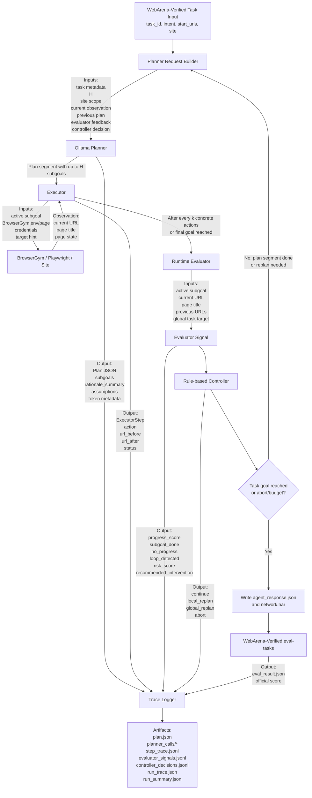

# Current H/k Process

This document describes the current state of the local H/k prototype for
selected WebArena-Verified tasks.

The prototype is intentionally still narrow:

- two official WebArena-Verified tasks: GitLab Task 44 and Shopping Task 118
- local Ollama planner
- scripted semantic executors for the supported tasks
- heuristic runtime evaluator
- rule-based controller
- WebArena-Verified remains the official final evaluator

Related non-H/k examples are already available for the wider local site set:

| Site | Current example path | Official evaluation |
|---|---|---|
| `gitlab` | hardcoded task, Planner preview, H/k orchestrator | yes |
| `shopping` | hardcoded task, Planner preview, H/k orchestrator | yes |
| `shopping_admin` | hardcoded task, Planner preview | yes |
| `reddit` | hardcoded retrieve task, Planner preview | yes |
| `wikipedia` | service probe, Planner preview direct task | no |
| `map` | excluded because of storage budget | no |

## Current Process



## Meaning Of H And k

`H` controls how far the Planner explicitly plans in one planner call.

- `H=0`: full plan, as far as the Planner can infer it
- `H=1`: one subgoal per planner call
- `H=2`: two subgoals per planner call

`k` controls how often the runtime Evaluator checks the current execution
trajectory.

- `k=1`: validate after every executor action
- `k=2`: validate after every two executor actions

The Evaluator does not replace WebArena-Verified. It only checks whether the
current execution still looks sensible with respect to the active subgoal and
global task.

## Current Task-44 Example

Command:

```bash
uv run python scripts/run_hk_task44_prototype.py --planner-mode ollama --model gemma4:26b --h 1 --k 1
```

Initial task:

```json
{
  "task_id": 44,
  "site": "gitlab",
  "intent": "Open my todos page",
  "start_urls": ["http://localhost:8012"]
}
```

With `H=1`, the Planner creates one subgoal per planner call.

### Planner Call 1

Input:

- task intent: open my todos page
- current URL: `http://localhost:8012/users/sign_in`
- page title: sign-in page
- login form visible: true
- previous plan: none

Output:

```json
{
  "subgoals": [
    {
      "id": "sg1",
      "objective": "Sign in to GitLab",
      "expected_outcome": "User is authenticated and redirected away from the sign-in page."
    }
  ]
}
```

Executor action:

```text
login_if_needed
```

Runtime Evaluator output:

```json
{
  "subgoal_done": true,
  "reason": "authenticated_or_no_login_form",
  "recommended_intervention": "continue"
}
```

### Planner Call 2

Input:

- current URL: `http://localhost:8012/dashboard/projects`
- page title: `Projects · GitLab`
- login form visible: false
- previous plan: sign-in plan
- evaluator feedback: authentication subgoal done
- controller decision: continue

Output:

```json
{
  "subgoals": [
    {
      "id": "sg1",
      "objective": "Navigate to the GitLab todos page",
      "expected_outcome": "The browser URL is http://localhost:8012/dashboard/todos"
    }
  ]
}
```

Executor action:

```text
goto("http://localhost:8012/dashboard/todos")
```

Runtime Evaluator output:

```json
{
  "subgoal_done": true,
  "reason": "todos_url_reached",
  "recommended_intervention": "continue"
}
```

Official WebArena-Verified result:

```json
{
  "score": 1.0,
  "status": "success"
}
```

## Current Sweep Result

Latest command:

```bash
uv run python scripts/run_hk_sweep.py --site gitlab --output-root output/hk-sweep/gitlab --hs 0 1 2 --ks 1 2 --model gemma4:26b
```

Current outcome:

| H | k | score | planner calls | interpretation |
|---:|---:|---:|---:|---|
| 0 | 1 | 1.0 | 1 | full plan solves the task in one planner call |
| 0 | 2 | 1.0 | 1 | full plan solves the task in one planner call |
| 1 | 1 | 1.0 | 2 | one-step planning needs continuation planning |
| 1 | 2 | 1.0 | 2 | one-step planning needs continuation planning |
| 2 | 1 | 1.0 | 1 | two-subgoal plan is enough for Task 44 |
| 2 | 2 | 1.0 | 1 | two-subgoal plan is enough for Task 44 |

The Task-44 example is small, so `k` has limited visible effect. The main
observable H effect is planner-call count and token/runtime cost.

## Shopping Multi-Action Example

Shopping Task 118 is now included as the first longer H/k test case:

```bash
uv run python scripts/run_hk_task44_prototype.py --site shopping --planner-mode ollama --model gemma4:26b --h 0 --k 1 --max-steps 5
```

Initial task:

```json
{
  "task_id": 118,
  "site": "shopping",
  "intent": "Open a shopping product page that matches the bruxism-related task.",
  "start_urls": ["http://localhost:7770"]
}
```

In this case, one Planner subgoal can require multiple concrete browser
actions. The current executor advances the same product-finding subgoal through
two actions:

```text
step 1: goto("http://localhost:7770/catalogsearch/result/?q=mouth+guard")
step 2: goto("http://localhost:7770/dentemp-ora-guard-custom-fit-dental-guard-bruxism-night-guard-for-teeth-grinding-two-pack-mouth-guard-for-clenching-teeth-at-night-mouth-guard-for-sleeping-relieve-soreness-in-jaw-muscles.html")
```

With `k=1`, the runtime Evaluator emits one signal after each action:

```text
step 1: shopping_search_results_reached, progress_score=0.5
step 2: target_product_page_reached, progress_score=1.0
```

With `k=2`, the same two actions are executed, but only the second action
triggers a runtime evaluation. This makes `k` meaningful as an action-level
validation interval rather than a subgoal-level switch.

Latest checked Shopping result:

```json
{
  "score": 1.0,
  "success": true,
  "final_url": "http://localhost:7770/dentemp-ora-guard-custom-fit-dental-guard-bruxism-night-guard-for-teeth-grinding-two-pack-mouth-guard-for-clenching-teeth-at-night-mouth-guard-for-sleeping-relieve-soreness-in-jaw-muscles.html"
}
```

## Written Artifacts

For one run:

```text
external/webarena-verified/output/hk-prototype/h1_k1/gitlab/44/
  plan.json
  planner_calls/
    call_01/
      plan.json
      planner_prompt.md
      planner_raw_response.txt
      warnings.json
    call_02/
      plan.json
      planner_prompt.md
      planner_raw_response.txt
      warnings.json
  step_trace.jsonl
  evaluator_signals.jsonl
  controller_decisions.jsonl
  run_trace.json
  run_summary.json
  network.har
  agent_response.json
  eval_result.json
```

For sweeps:

```text
external/webarena-verified/output/hk-sweep/gitlab/summary.json
external/webarena-verified/output/hk-sweep/gitlab/summary.csv
external/webarena-verified/output/hk-sweep/shopping/summary.json
external/webarena-verified/output/hk-sweep/shopping/summary.csv
```

Notebook:

```text
notebooks/08_hk_sweep_analysis.ipynb
```

## Next Step

The next useful step is to use the same runner for a small H/k sweep on both
GitLab Task 44 and Shopping Task 118.

Recommended order:

1. Keep Task 44 as the reference sanity check.
2. Run Shopping Task 118 with `k=1` and `k=2` to compare intermediate signals.
3. Add a notebook section that compares GitLab and Shopping H/k traces.
4. Optionally add an LLM-assisted runtime Evaluator only for ambiguous semantic
   checks, while keeping WebArena-Verified as the final official evaluator.

For thesis writing, Task 44 is useful to explain continuation planning through
`H`. Shopping Task 118 is the first useful example for explaining why `k` should
operate on concrete browser actions.
