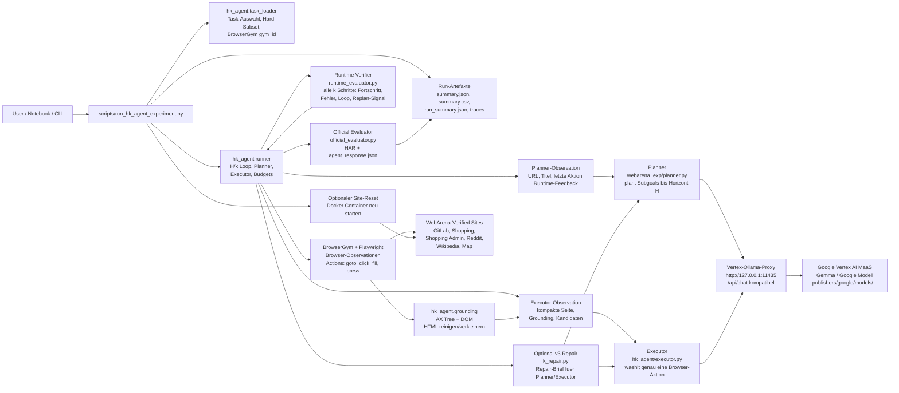
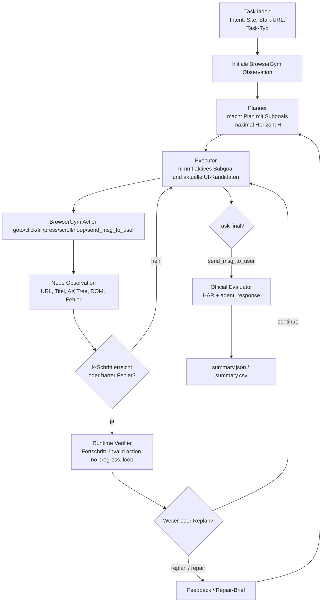
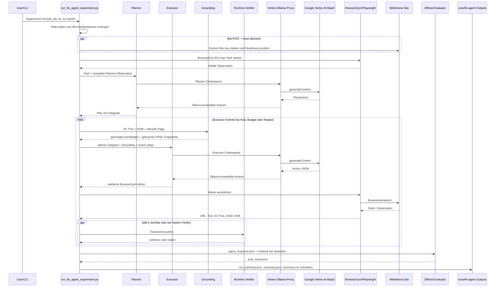

# H/k-Agent ausfuehren mit Google Vertex AI MaaS

Diese Notiz beschreibt die Ausfuehrung fuer Experimente wie `hk-agent-browsergym-planact-main-v02_basis_v3`, aber ohne lokale Ollama-Modelle. Die LLM-Aufrufe laufen ueber Google Vertex AI MaaS. Lokal laeuft nur ein kleiner Proxy, weil der bestehende Runner eine Ollama-kompatible `/api/chat`-Schnittstelle erwartet.

## Kurzfassung

Startreihenfolge:

1. WebArena-Verified Services starten, z. B. GitLab, Shopping, Shopping Admin, Reddit.
2. Google-Authentifizierung und Projektvariablen setzen.
3. Vertex-Ollama-Proxy auf `http://127.0.0.1:11435` starten.
4. `scripts/run_hk_agent_experiment.py` mit `--ollama-base-url http://127.0.0.1:11435` ausfuehren.
5. Ergebnisse unter `runs/hk-agent/<experiment-name>/summary.json` und `summary.csv` auswerten.

Wichtig: `--ollama-base-url` bedeutet in diesem Setup nicht, dass lokale Ollama-Modelle verwendet werden. Die URL zeigt auf den lokalen Proxy, der die Requests an Google Vertex AI weiterleitet.

## Architektur



## Komponenten

| Komponente | Aufgabe | Lokal oder Google |
|---|---|---|
| `scripts/run_hk_agent_experiment.py` | Experiment-CLI, Task-Auswahl, H/k-Kombinationen, Resume, Summary | lokal |
| `hk_agent.runner` | Orchestriert den einzelnen H/k-Run: Planner-Calls, Executor-Schritte, k-Pruefung, Budgets, Artefakte | lokal |
| `webarena_exp.planner` | Erstellt aus Task, Plan-Historie und kompakter Observation einen Plan mit Subgoals | lokal, LLM-Call ueber Google |
| `hk_agent.executor` | Uebersetzt ein aktives Subgoal in genau eine BrowserGym-Aktion und validiert die Modellantwort | lokal, LLM-Call ueber Google |
| `hk_agent.grounding` | Extrahiert sichtbare/actionable Elemente aus AX Tree und DOM, bereinigt HTML und erzeugt Kandidaten mit `bid` | lokal |
| `hk_agent.runtime_evaluator` | Laufzeit-Verifier: bewertet Fortschritt, Fehler, Loops und empfiehlt Continue oder Replan | lokal |
| `hk_agent.k_repair` | Optional bei Repair-Architekturen: verdichtet Fehler in einen Repair-Brief fuer Planner/Executor | lokal, ggf. LLM-Call ueber Google |
| `hk_agent.official_evaluator` | Startet die offizielle WebArena-Verified Evaluation nach dem Run | lokal |
| BrowserGym / Playwright | Oeffnet Browser, sammelt Observationen, fuehrt Aktionen aus | lokal |
| WebArena-Verified Sites | Ziel-Webseiten fuer die Tasks, meist Docker-Container | lokal |
| `scripts/vertex_ollama_proxy.py` | Uebersetzt Ollama-Chat-Requests in Vertex-AI-Requests | lokal, aber keine lokale Inferenz |
| Google Vertex AI MaaS | Fuehrt das eigentliche Google/Gemma-Modell aus | Google Cloud |
| `runs/hk-agent/...` | Persistente Run-Outputs, Summaries und Diagnostik | lokal |

## Inhaltliche Agentenlogik

Der Lauf ist nicht nur ein einzelner LLM-Call. Er ist eine Planner-Executor-Schleife mit H/k-Kontrolle:



### Planner

Der Planner ist fuer die grobe Strategie verantwortlich. Er bekommt nicht den ganzen DOM oder die komplette HTML-Seite, sondern eine bewusst kleine Sicht:

- Task-Intent und Task-Metadaten.
- Aktuelle URL und Seitentitel.
- Letzte Aktion und letzter Aktionsfehler.
- Vorherigen Plan, wenn vorhanden.
- Runtime-Verifier-Feedback, wenn der Lauf nach `k` Schritten oder wegen eines Fehlers neu geplant wird.
- Bei PlanAct/v3 auch kurze Ausschnitte der letzten Aktionen.

Der Planner erzeugt Subgoals. Bei `--hs 5` plant er typischerweise einen kurzen Horizont von bis zu 5 Subgoals, statt den gesamten Task blind in einem Rutsch zu loesen.

### Executor

Der Executor ist fuer die konkrete Bedienung verantwortlich. Er bekommt ein aktives Subgoal und eine aktuelle, geerdete UI-Sicht. Er darf pro Call genau eine Aktion erzeugen, zum Beispiel:

- `goto("...")`
- `click("bid")`
- `fill("bid", "text")`
- `press("bid", "Enter")`
- `scroll(0, 1200)`
- `noop(1000)`
- `send_msg_to_user("{...}")`

Wichtig ist das `bid`-Prinzip: Klicks und Fills sollen aktuelle BrowserGym-/DOM-Kandidaten verwenden, nicht frei erfundene CSS-Selektoren oder sichtbare Texte. Dadurch wird aus dem Sprachmodell eine kontrollierte Aktionsauswahl ueber konkret sichtbare Elemente.

### Verkleinerte HTML- und Seitenreprasentation

Die Webseite wird nicht als kompletter HTML-Dump an das Modell geschickt. Das waere zu gross, teuer und fehleranfaellig. Stattdessen baut `hk_agent.grounding` eine kompakte Repraesentation:

- Accessibility-Tree-Kandidaten mit `bid`, Rolle und sichtbarem Namen.
- DOM-Kandidaten fuer Links, Buttons, Inputs, Textareas, Selects, Dialoge und Editor-Elemente.
- Kontext wie Label-Text, Zeilenkontext, Formulartext, Modaltext, Parent-/Section-Text.
- Gekuerztes und gereinigtes `outerHTML` fuer relevante Kandidaten.
- Normalisierte Texte mit Whitespace-Kompression und Laengenlimits.

Im Executor-Prompt landen dadurch nicht "die ganze Seite", sondern:

- `current_observation`: kurzer Auszug aus BrowserGym/Playwright.
- `interactive_candidates` / `action_candidates`: die wichtigsten sichtbaren Ziele.
- `candidate_html`: gekuerzte HTML-Fragmente nur fuer Kandidaten.
- `link_candidates`: gerankte Links, besonders wichtig fuer Shopping-`.html`-Produktseiten.
- `recent_steps`: kurze Historie, damit Wiederholungen erkannt werden.

Das ist methodisch wichtig: Der Planner plant abstrakt, der Executor handelt geerdet auf einer reduzierten, aktuellen HTML-/DOM-Sicht.

### Runtime Verifier

Der Runtime Verifier ist nicht der offizielle WebArena-Evaluator. Er bewertet waehrend des Laufs nur Prozesssignale:

- Hat sich URL oder Titel veraendert?
- Gab es einen Aktionsfehler?
- Ist eine 404-/Not-Found-Seite erreicht worden?
- Wiederholen sich URLs oder Aktionen?
- Wurde bereits eine finale Antwort gesendet?

Aus diesen Signalen entsteht ein `EvaluatorSignal` mit `progress_score`, `invalid_action`, `no_progress`, `loop_detected` und `recommended_intervention`. Bei `--ks 10` wird diese Kontrolllogik nach 10 Executor-Schritten bzw. bei harten Fehlern relevant und kann einen Replan ausloesen.

### Official Evaluator

Der Official Evaluator laeuft erst nach der Agenten-Ausfuehrung. Er verwendet die WebArena-Verified-Logik und bewertet:

- `agent_response.json`, also die finale Antwort des Agenten.
- `network.har`, also die aufgezeichneten Browser-/Netzwerkereignisse.
- Die Task-Konfiguration aus WebArena-Verified.

Das Ergebnis landet in `eval_result.json` und wird in `run_summary.json`, `summary.json` und `summary.csv` uebernommen. Mit `--success-policy contamination_adjusted` werden bekannte Evaluator-Kontaminationsfaelle im Report angepasst, waehrend Raw-Werte erhalten bleiben.

## H und k

`H` und `k` steuern unterschiedliche Dinge:

| Parameter | Rolle |
|---|---|
| `H` / `--hs` | Planungshorizont: wie viele Subgoals der Planner pro Plan erzeugt bzw. wie weit er vorausdenken soll. |
| `k` / `--ks` | Kontrollintervall: nach wie vielen Executor-Schritten der Runtime Verifier den Laufzustand bewertet und ggf. Replanning ausloest. |

Beispiel `--hs 5 --ks 10`: Der Planner arbeitet mit einem Horizont von 5 Subgoals. Der Executor fuehrt daraus konkrete Browseraktionen aus. Nach 10 Schritten oder bei deutlichen Fehlern bewertet der Runtime Verifier den Fortschritt; bei Problemen fliesst das Feedback in einen neuen Plan ein.

## Google-Only Setup

### 1. Google Cloud vorbereiten

Einmalig bzw. pro Shell:

```bash
gcloud auth application-default login
export GOOGLE_CLOUD_PROJECT="<dein-google-cloud-project>"
export GOOGLE_CLOUD_LOCATION="global"
export VERTEX_MAAS_PUBLISHER="google"
export VERTEX_MAAS_MODEL="gemma-4-26b-a4b-it-maas"
```

Quellen fuer Modell und Preise:

- Offizielle Modellseite: `https://docs.cloud.google.com/gemini-enterprise-agent-platform/models/maas/google/gemma-4-26b-a4b-it`
- Offizielle Vertex-AI-Preisseite: `https://cloud.google.com/vertex-ai/docs/generative-ai/pricing`

Falls ein anderes Google/Vertex-Modell genutzt werden soll, wird nur `VERTEX_MAAS_MODEL` angepasst. Der Runner kann weiterhin Alias-Namen wie `gemma4:26b` oder `gemma4:e4b` speichern; mit `--force-default-model` routet der Proxy beide Namen auf das in `VERTEX_MAAS_MODEL` gesetzte Google-Modell.

## Kostenrechnung

Die Kosten werden nicht waehrend des Runs abgerechnet, sondern in den Analyse-Notebooks als Schaetzung aus Tokenzaehlern berechnet. Die relevanten Spalten kommen aus `summary.csv`:

- `prompt_tokens` bzw. `planner_prompt_tokens` und `executor_prompt_tokens`
- `completion_tokens` bzw. `planner_completion_tokens` und `executor_completion_tokens`
- Fallback fuer alte Runs: `total_tokens`

Die Formel in den Notebooks ist:

```text
estimated_token_cost_usd =
  billable_input_tokens_est / 1_000_000 * INPUT_PRICE_PER_1M_USD
  + output_tokens_est / 1_000_000 * OUTPUT_PRICE_PER_1M_USD
  + cache_hit_tokens_est / 1_000_000 * CACHE_HIT_PRICE_PER_1M_USD
```

Die bisher verwendeten Annahmen sind:

| Parameter | Wert |
|---|---:|
| `INPUT_PRICE_PER_1M_USD` | 0.15 USD |
| `OUTPUT_PRICE_PER_1M_USD` | 0.60 USD |
| `CACHE_HIT_PRICE_PER_1M_USD` | 0.015 USD |
| `CACHE_HIT_RATE` | 0.0 |

Vor finaler Abgabe sollten diese Werte gegen die aktuelle Google-Preisseite geprueft werden, weil Cloud-Preise und Modellverfuegbarkeit zeitabhaengig sind.

### 2. Vertex-Ollama-Proxy starten

In einem eigenen Terminal:

```bash
uv run python scripts/vertex_ollama_proxy.py \
  --host 127.0.0.1 \
  --port 11435 \
  --project-id "$GOOGLE_CLOUD_PROJECT" \
  --location "$GOOGLE_CLOUD_LOCATION" \
  --publisher "$VERTEX_MAAS_PUBLISHER" \
  --model "$VERTEX_MAAS_MODEL" \
  --force-default-model \
  --timeout-seconds 600
```

Der Proxy muss waehrend des gesamten Experiments laufen. Er implementiert nur die fuer den Runner benoetigte Ollama-kompatible Route `/api/chat`.

### 3. WebArena-Verified Services bereitstellen

Die WebArena-Sites muessen erreichbar sein. Fuer die Standard-Ports erwartet der Code typischerweise:

| Site | URL / Port |
|---|---|
| Shopping | `http://localhost:7770/` |
| Shopping Admin | `http://localhost:7780/admin` |
| Reddit | `http://localhost:9999/` |
| GitLab | `http://localhost:8023/users/sign_in` |
| Homepage | `http://localhost:4399` |

Bei `--reset-site-before-mutate` startet der Runner MUTATE-Sites vor dem jeweiligen Run per Docker neu. Das ist langsamer, aber fuer veraendernde Tasks sauberer, weil alte Seiteneffekte reduziert werden.

## Beispielkommando fuer Task 550

Google-only Variante deines Beispiels:

```bash
uv run python scripts/run_hk_agent_experiment.py \
  --experiment-name hk-agent-browsergym-planact-main-v02_basis_v3 \
  --task-ids 550 \
  --hs 5 \
  --ks 10 \
  --run-mode agent \
  --planner-model gemma4:26b \
  --executor-model gemma4:e4b \
  --agent-architecture v3 \
  --max-steps-policy tiered \
  --max-steps-navigation 20 \
  --max-steps-retrieval 30 \
  --max-steps-policy-task 25 \
  --max-steps-mutation 50 \
  --max-planner-calls 0 \
  --planner-call-margin 2 \
  --max-steps 500 \
  --llm-timeout-seconds 600 \
  --max-consecutive-llm-timeouts 0 \
  --success-policy contamination_adjusted \
  --ollama-base-url http://127.0.0.1:11435 \
  --reset-site-before-mutate \
  --site-reset-timeout-seconds 300 \
  --resume-summary \
  --replace-requested-runs \
  --refresh-existing-diagnostics
```

Dieses Kommando nutzt Google Vertex AI, solange der Proxy auf Port `11435` laeuft und mit `--force-default-model` auf ein Google-Modell zeigt.

## Was die wichtigsten Flags bedeuten

| Flag | Bedeutung |
|---|---|
| `--experiment-name` | Name des Output-Ordners unter `runs/hk-agent/`. |
| `--task-ids 550` | Fuehrt genau Task 550 aus. Mehrere IDs koennen mit Leerzeichen angegeben werden. |
| `--hs 5` | H-Horizont: nach wie vielen Schritten typischerweise geplant bzw. strukturiert weitergearbeitet wird. |
| `--ks 10` | K-Wert fuer die Agenten-/Planungslogik. |
| `--run-mode agent` | Fuehrt den echten Agenten gegen BrowserGym aus. |
| `--planner-model` | Modellname, der fuer Planner-Calls geloggt und an `/api/chat` gesendet wird. |
| `--executor-model` | Modellname fuer Executor-Calls. |
| `--agent-architecture v3` | Nutzt die v3-Architektur des Agenten. |
| `--max-steps-policy tiered` | Nutzt je nach Task-Typ unterschiedliche Step-Budgets. |
| `--max-steps-navigation/retrieval/policy-task/mutation` | Budgets fuer die einzelnen Capability-Tiers. |
| `--max-planner-calls 0` | Deaktiviert das Planner-Call-Budget. |
| `--max-steps 500` | Globaler Sicherheitswert; bei `tiered` zaehlen die spezifischen Budgets pro Tier. |
| `--llm-timeout-seconds 600` | Timeout pro LLM-Request. |
| `--success-policy contamination_adjusted` | Wertet bekannte Evaluator-Kontaminationsfaelle angepasst aus, bewahrt aber Raw-Werte. |
| `--ollama-base-url http://127.0.0.1:11435` | Zeigt auf den Vertex-Ollama-Proxy, nicht auf lokale Inferenz. |
| `--reset-site-before-mutate` | Startet nur bei MUTATE-Tasks die betroffene Site neu. |
| `--resume-summary` | Erhaelt bestehende Summary-Zeilen und fuegt fehlende Runs hinzu. |
| `--replace-requested-runs` | Entfernt und wiederholt nur die angefragten Task/H/K-Kombinationen. |
| `--refresh-existing-diagnostics` | Aktualisiert Diagnostikspalten aus vorhandenen Artefakten. |

## Allgemeiner Ablauf im Experiment



## Outputs

Nach dem Lauf liegen die wichtigsten Dateien hier:

```text
runs/hk-agent/<experiment-name>/
  experiment_config.json
  selected_tasks.json
  summary.json
  summary.csv
  <site>/<task_id>/h<h>_k<k>/<task_id>/
    run_summary.json
    diagnostic.json
    agent_response.json
    eval_result.json
    network.har
```

Fuer den schnellen Check sind meistens `summary.csv`, `summary.json` und der jeweilige `run_summary.json` am wichtigsten.

## Typische Checks

Proxy erreichbar:

```bash
curl http://127.0.0.1:11435/api/tags
```

Summary nach dem Lauf ansehen:

```bash
uv run python -m json.tool runs/hk-agent/hk-agent-browsergym-planact-main-v02_basis_v3/summary.json
```

Nur vorhandene Diagnostik neu schreiben, ohne neue Runs zu starten:

```bash
uv run python scripts/run_hk_agent_experiment.py \
  --experiment-name hk-agent-browsergym-planact-main-v02_basis_v3 \
  --task-ids 550 \
  --hs 5 \
  --ks 10 \
  --run-mode agent \
  --agent-architecture v3 \
  --ollama-base-url http://127.0.0.1:11435 \
  --success-policy contamination_adjusted \
  --refresh-existing-only
```
