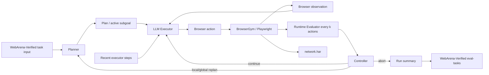

# LLM Executor Architecture

This document describes the current action-executor implementation for the
local WebArena-Verified H/k thesis prototype.

## Purpose

The initial H/k prototype used heuristic and scripted executors. That was
useful for smoke tests, but it does not represent a fair autonomous web-agent
setup. The current architecture therefore separates the strategic planner from
an action-level executor:



The Planner produces high-level subgoals. The Executor turns one active subgoal
and the current browser observation into one concrete browser action.

## External Influence

The implementation follows these patterns conceptually:

- WebArena / BrowserGym: web task execution as an observation-action loop.
- WebArena-Verified: official final evaluation remains separate from runtime
  reasoning.
- AgentLab: swappable modules and reproducible run artifacts.
- Planning-agent literature: structured subgoals and concise rationale
  summaries instead of hidden chain-of-thought logs.
- Plan-and-Act: planner/replanner prompts are adapted at the conceptual level:
  the Planner groups future work into high-level, specific steps; the Replanner
  uses previous actions, current observation, and previous plans to revise only
  the remaining work. The prototype does not use the paper's future-action
  trajectory annotation prompts at runtime because that would leak oracle
  information unavailable to a real agent.

No external repository code is copied directly into the executor.

## Current Files

- `prompts/executor_system.md`
  - system prompt and JSON contract for action selection.
- `scripts/webarena_exp/executor.py`
  - `LLMActionExecutor`
  - executor prompt construction
  - Ollama executor call
  - action validation
  - small Playwright fallback for `click`, `fill`, `type`, `press`, and
    `select_option`
- `scripts/webarena_exp/logging.py`
  - writes `executor_calls.jsonl`
  - writes one folder per executor call under `executor_calls/call_XX/`
- `scripts/run_hk_task.py`
  - neutral entry point for one H/k task run.
- `scripts/main_execution.py`
  - experiment runner for one or many task ids.

## Executor Input

The LLM Executor receives:

- task id
- site name
- task intent
- start URLs
- active subgoal
- current URL
- page title
- compact visible text excerpt
- recent executor steps
- non-oracle site conventions
- task-derived route hints for common site conventions
- allowed action examples

It does not receive evaluator metadata, gold URLs, reference answers, or hidden
target hints when `--target-hint-mode none` is used.

The route hints are not copied from the official evaluator. They are derived
from the visible task intent and stable site conventions, for example:

- GitLab todos use `/dashboard/todos`.
- GitLab repository issues use `/<namespace>/<project>/-/issues`.
- Magento customer navigation uses the admin customer route.
- Shopping product-page tasks should continue from search results to a `.html`
  product detail page.

## Executor Output

The executor must return valid JSON:

```json
{
  "subgoal_id": "sg2",
  "action": "goto(\"http://localhost:8023/OpenAPITools/openapi-generator\")",
  "action_type": "navigate",
  "rationale_summary": "The task intent names this GitLab repository.",
  "expected_observation": "The repository page is visible."
}
```

The action is validated before execution. Site-local `goto(...)` actions must
stay inside the current benchmark base URL.

## Logged Artifacts

For every LLM executor call, the runner writes:

```text
executor_calls.jsonl
executor_calls/call_XX/executor_prompt.md
executor_calls/call_XX/executor_raw_response.txt
executor_calls/call_XX/executor_action.json
```

The run summary also includes:

- `executor_mode`
- `num_executor_calls`
- `executor_tokens`
- combined `total_tokens`
- combined `prompt_tokens`
- combined `completion_tokens`

Planner and executor token usage are therefore visible separately enough for
analysis, while the combined fields still support whole-run cost analysis.

## Example: GitLab Task 105 Without Target Hint

Command:

```bash
WA_GITLAB=http://localhost:8023 \
WA_GITLAB_USERNAME=byteblaze \
WA_GITLAB_PASSWORD=hello1234 \
uv run python scripts/main_execution.py \
  --task-ids 105 \
  --experiment-name task105-llm-executor-nohint-smoke-v3 \
  --hs 0 \
  --ks 1 \
  --planner-mode ollama \
  --executor-mode llm \
  --model gemma4:26b \
  --target-hint-mode none \
  --max-planner-calls 1 \
  --max-steps 4
```

Observed behavior:

```text
step 1: login_if_needed
step 2: goto("http://localhost:8023/OpenAPITools/openapi-generator")
step 3: noop("The browser is already on the OpenAPITools/openapi-generator repository page...")
```

Summary:

```text
score: 0.0
success: false
num_planner_calls: 1
num_executor_calls: 2
executor_tokens: 7506
final_url: http://localhost:8023/OpenAPITools/openapi-generator
```

Interpretation: the action executor can now infer and execute a meaningful
site-local GitLab navigation from the task intent without using a gold target
hint. It does not yet reliably continue from the repository page to the issue
list and label filter. That is the next executor-improvement target.

## Current Limitation

The executor is now an LLM-based action policy, but it is still minimal. It can
execute simple browser actions and log its reasoning interface, but it does not
yet have robust element grounding, DOM candidate selection, or long action
repair. For thesis experiments, this should be described as the first
autonomous executor layer, not as a mature WebArena agent.

## Current Smoke Result

After adding task-derived site guidance and a more tolerant action parser, the
following no-target-hint smoke run succeeds with official score `1.0` for the
three navigation examples:

```bash
WA_GITLAB=http://localhost:8023 \
WA_GITLAB_USERNAME=byteblaze \
WA_GITLAB_PASSWORD=hello1234 \
uv run python scripts/main_execution.py \
  --task-ids 44 157 118 \
  --experiment-name llm-executor-guidance-check-44-157-118-v2 \
  --hs 0 \
  --ks 1 \
  --planner-mode ollama \
  --executor-mode llm \
  --model gemma4:26b \
  --executor-model gemma4:e4b \
  --target-hint-mode none \
  --max-planner-calls 1 \
  --max-steps 5
```

Observed final pages:

- Task 44: `http://localhost:8023/dashboard/todos`
- Task 157: `http://localhost:7780/admin/customer/index`
- Task 118: a shopping `.html` mouth-guard product page

## Next Implementation Step

The next useful improvement is to add action grounding support:

- provide a compact list of clickable texts/links from the current page,
- ask the executor to choose from those candidates,
- detect no-op clicks when URL and page title do not change,
- feed that failure back into the next executor call,
- keep WebArena-Verified as the only official final evaluator.
