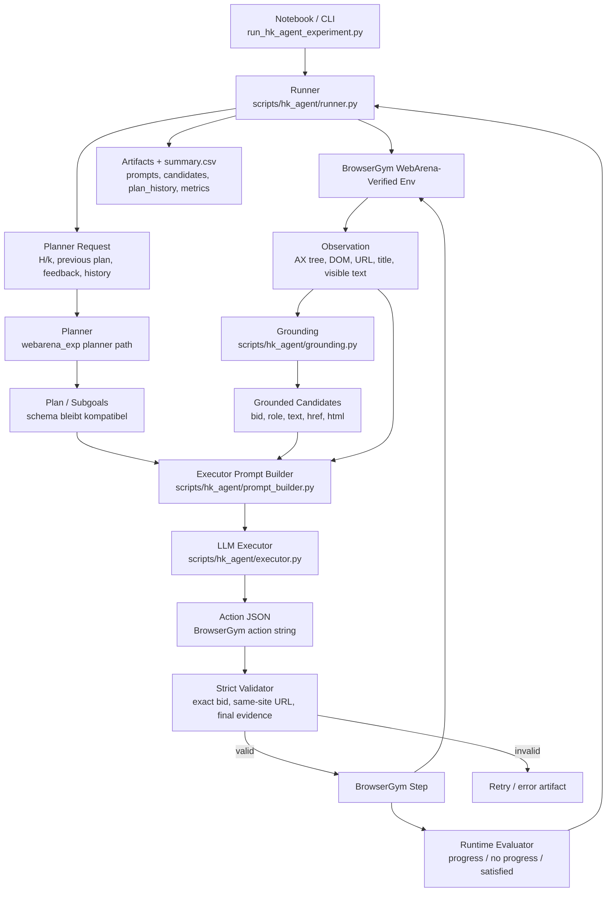
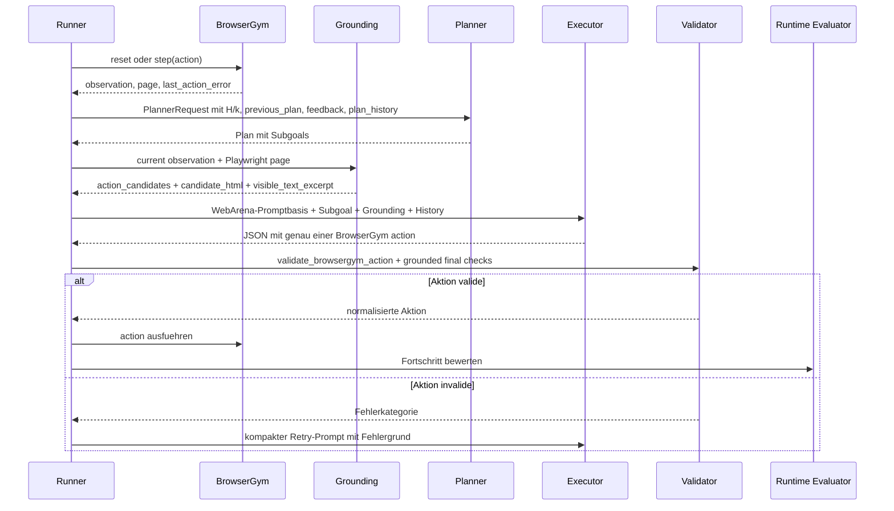
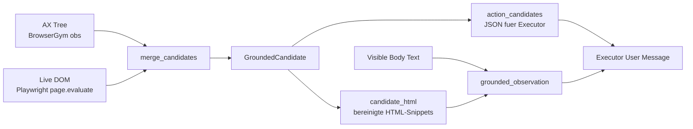
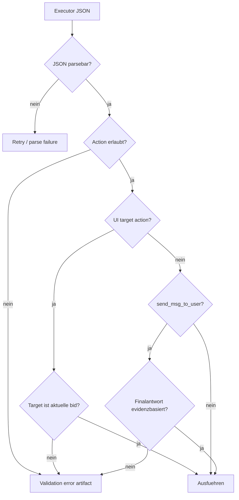

# v2_planact Architektur

Diese Dokumentation beschreibt die neue Agent-Variante `v2_planact`. Ziel ist nicht, die bestehende `v2`-Architektur zu ersetzen, sondern eine klar messbare Erweiterung zu bauen: Der Executor wird staerker an die aktuelle Browser-Beobachtung gebunden, der Planner bekommt eine echte Planhistorie, und alle Entscheidungen werden besser protokolliert.

Wichtig fuer die Masterarbeit: `v2_planact` nutzt weiterhin die WebArena-Verified-Aufgaben, Task-Contracts und finale offizielle Evaluation als Grundlage. Die zusaetzlichen Regeln dienen der robusteren Ausfuehrung und Nachvollziehbarkeit. Sie duerfen keine Gold-Antworten, Evaluator-Metadaten oder hartcodierten Task-Loesungen einfuehren.

## Kurzidee

`v2_planact` kombiniert drei Dinge:

- WebArena-Verified Promptbasis: Die urspruenglichen WebArena-Verified Beispielprompts werden als Grundlage fuer den Executor gerendert.
- Plan-and-Act-inspiriertes Grounding: Der Executor bekommt nicht nur freien Beobachtungstext, sondern aktuelle, bereinigte DOM-/AX-Kandidaten mit exakten `bid`s.
- Strikte Validierung: Aktionen wie `click`, `fill`, `press` und `select_option` duerfen nur auf aktuell sichtbare Kandidaten zeigen. Finalantworten werden gegen sichtbare Evidenz geprueft.

## Architekturuebersicht



## Ablauf pro Agent-Step



## Zentrale Dateien

| Datei | Rolle |
| --- | --- |
| `scripts/hk_agent/runner.py` | Orchestriert BrowserGym, Planner, Executor, Runtime-Evaluator, H/k-Logik und Artefakte. |
| `scripts/hk_agent/executor.py` | Baut Executor-Aufrufe, parsed JSON, validiert Aktionen, prueft finale Antworten und fuehrt kleine deterministische Normalisierungen aus. |
| `scripts/hk_agent/grounding.py` | Extrahiert aktuelle DOM-/AX-Kandidaten, bereinigt HTML und erstellt die grounded observation. |
| `scripts/hk_agent/prompt_builder.py` | Kombiniert WebArena-Verified Promptbasis mit `v2`-/`v2_planact`-Regeln und Site-Kontext. |
| `prompts/v2/executor_base.md` | Gemeinsame Executor-Regeln, inklusive Grounding-Hinweise fuer `v2_planact`. |
| `scripts/vertex_ollama_proxy.py` | Ollama-kompatibler Proxy fuer Google Vertex AI MaaS. |
| `notebooks/12_vertex_gemma_maas_task44_smoke.ipynb` | Notebook fuer den 12-Task-Sweep mit `v2_planact`, Vertex-Proxy und Auswertung. |
| `tests/test_hk_agent_planact.py` | Unit-Tests fuer Grounding, Validator, URL-/Scroll-Normalisierung und finale Evidenzchecks. |

## Was sich gegenueber v2 aendert

`v2` bleibt unveraendert vergleichbar. `v2_planact` ist eine neue Variante mit strengeren Regeln:

- UI-Aktionen duerfen nur aktuelle `bid`s verwenden.
- Sichtbare Labels wie `"Search"` oder `"12 Reviews"` sind keine erlaubten UI-Ziele, wenn sie nicht selbst eine aktuelle `bid` sind.
- CSS-Selektoren wie `#search` oder `.button` werden abgelehnt.
- `goto(...)` ist nur fuer gleiche Site bzw. normalisierte sichtbare Links erlaubt.
- `RETRIEVE` darf nur mit `SUCCESS` enden, wenn die zurueckgegebenen Werte im sichtbaren Text oder bereinigten DOM belegbar sind.
- `MUTATE` darf nicht mit `SUCCESS` enden, bevor eine echte mutierende Aktion ausgefuehrt wurde.
- Aktionsfehler aus den letzten Schritten verhindern voreilige Erfolgsantworten.
- Fuer `NAVIGATE` kann der Runner eine sichtbare Zielerfuellung automatisch als finalen Erfolg markieren, wenn die Route bereits offiziell passt.

## Grounding

Das Grounding ist der wichtigste Unterschied. Es wird pro Executor-Aufruf neu aus der aktuellen Seite erzeugt.



Ein `GroundedCandidate` enthaelt unter anderem:

- `bid`: die konkrete BrowserGym-Ziel-ID.
- `role` oder `tag`: z. B. `button`, `link`, `input`, `select`.
- `text`: sichtbarer Text.
- `href`: Linkziel, falls vorhanden.
- `placeholder`, `aria_label`, `name`, `value`: Formular- und Accessibility-Informationen.
- `html`: bereinigter HTML-Ausschnitt ohne Scripts, Styles und unnuetze Attribute.
- `source`: `dom`, `ax` oder kombiniert.

Der Executor soll dadurch weniger raten. Statt `click("Search")` soll er z. B. `click("42")` verwenden, wenn Kandidat `42` aktuell der Suchbutton ist.

Zusaetzlich wird die Kandidatenliste taskbezogen sortiert. Dabei werden nur Informationen verwendet, die aus der Aufgabe, dem aktiven Subgoal und der aktuell sichtbaren Seite stammen. Es werden keine Evaluator-Antworten oder Gold-Daten genutzt. Hoeher priorisiert werden zum Beispiel:

- Kandidaten, deren Text, Name, Placeholder, Link oder Tabellenzeilen-Kontext Taskwoerter enthaelt.
- Formularfelder und Buttons, wenn die Aufgabe eine Eingabe oder Mutation nahelegt.
- Shopping-Admin-Grid-Zeilen, deren Row-Kontext Produkt-, Status-, Filter- oder Stock-Begriffe enthaelt.
- GitLab-Elemente mit Projekt-, Gruppen-, Datei-, Edit-, Commit- oder Fork-Kontext.

Wenn der Executor eine ungueltige oder veraltete `bid` nutzt, wird vor dem kompakten Retry die Seite kurz neu beobachtet und die Kandidatenliste erneut extrahiert. Das ist methodisch vertretbar, weil es nur die aktuelle Browseroberflaeche aktualisiert und keine externe Loesungsinformation einfuehrt.

## Promptstruktur

Die Promptbasis bleibt methodisch wichtig:

1. `prompt_builder.py` sucht zuerst einen passenden WebArena-Verified Beispielprompt unter `external/webarena-verified/examples/prompts`.
2. Dieser Prompt wird mit Intent und Start-URLs der aktuellen Aufgabe gerendert.
3. Danach werden die allgemeinen `v2`-Executor-Regeln angehaengt.
4. Danach werden optionale Site-spezifische Regeln angehaengt.
5. Im Executor-User-Message-JSON kommen aktuelle Daten hinzu: Subgoal, Observation, Kandidaten, Links, Site-Konventionen und History.

Dadurch ist die Grundlage weiterhin WebArena-Verified, waehrend `v2_planact` nur die operative Ausfuehrung strenger und beobachtbarer macht.

## Planner und H/k-Semantik

Die H/k-Semantik bleibt erhalten:

- `h` steuert den Planungshorizont.
- `k` steuert, wann replanning erlaubt bzw. sinnvoll ist.
- Planner Calls passieren nicht blind nach jedem Step, sondern bei initialer Planung, Horizon-Grenzen und runtime-getriggerten Replans.

Fuer `v2_planact` schreibt der Runner zusaetzlich `plan_history.json`. Darin stehen:

- initialer Plan,
- spaetere Planversionen,
- vorherige Executor-Aktionen,
- Runtime-Evaluator-Feedback,
- kompakte Beobachtungssnapshots.

So kann man spaeter sehen, ob der Planner einen Plan beibehalten, repariert oder ersetzt hat.

## Step- und Planner-Budgets

Fuer die Hauptlaeufe kann `v2_planact` mit einer festen oder einer capability-basierten Step-Policy gestartet werden. Die capability-basierte Variante ist fuer die Masterarbeit besser begruendbar als eine freie Task-ID-spezifische Anpassung, weil sie reproduzierbare Klassen nutzt:

| Capability-Tier | `max_steps` |
| --- | ---: |
| `navigation` | 10 |
| `visible_retrieve` / `structured_retrieve` | 20 |
| `policy` | 15 |
| `mutation` | 30 |

Die Werte werden in `notebooks/11_webarena_verified_hard_eda.ipynb` mit beobachteten Agent-Schritten aus vorhandenen `summary.csv`-Runs verglichen. Sie sind also nicht als optimale Ground-Truth-Schrittzahl zu verstehen, sondern als transparente Ressourcenklassen.

Mit `--max-planner-calls auto` wird das Planner-Budget danach pro Run aus dem jeweiligen Step-Budget und dem Horizon `h` berechnet:

```text
max_planner_calls(h, task) = ceil(max_steps(task) / h) + margin
```

Fuer `h=0` wird nur ein kleiner Runtime-Replan-Puffer genutzt. Dadurch bekommt z. B. ein `h=5`-Run mit `max_steps=20` nicht unnoetig so viele Planner Calls wie ein `h=2`-Run.

## Executor-Validierung



Beispiele fuer abgelehnte Aktionen:

```text
click("Search")
click("12 Reviews")
click("#search")
fill("search-input", "abc")
```

Beispiele fuer erlaubte Aktionen, wenn die `bid` aktuell vorhanden ist:

```text
click("42")
fill("17", "wireless headphones")
press("17", "Enter")
select_option("21", "Pending")
scroll(0, 600)
goto("http://reddit.localhost/f/personalfinance/new")
```

## Besondere Behandlung von MUTATE

MUTATE-Aufgaben sind methodisch besonders heikel, weil ein Agent hier nicht nur etwas finden oder anzeigen muss, sondern einen Zustand aendern oder eine begruendete Policy-Entscheidung treffen muss.

`v2_planact` behandelt MUTATE deshalb strenger:

- `SUCCESS` ist erst erlaubt, wenn vorher mindestens eine sichtbare mutierende Aktion passiert ist, z. B. `click`, `fill`, `press` oder `select_option`.
- Nach einem aktuellen Aktionsfehler darf nicht direkt erfolgreich beendet werden.
- Fuer echte State-Change-Aufgaben muss der Executor in `rationale_summary` oder `expected_observation` eine aktuelle sichtbare Bestaetigung oder Zustandsaenderung nennen, z. B. dass die Seite eine gespeicherte, erstellte, aktualisierte oder anderweitig bestaetigte Aenderung zeigt.
- Artefakte markieren MUTATE-Runs gesondert, damit sie separat ausgewertet werden koennen.
- Die Summary enthaelt optionale MUTATE-Metriken, ohne die bestehenden `summary.csv`-Spalten kaputt zu machen.

Fuer die Masterarbeit ist das wichtig, weil MUTATE-Erfolge sonst leicht kuenstlich wirken koennen. Die neue Logik soll gerade verhindern, dass der Agent einfach behauptet, etwas erledigt zu haben.

## Vertex-Proxy ueber Google API

Der Lauf kann ueber `scripts/vertex_ollama_proxy.py` gehen. Der Proxy stellt lokal eine Ollama-kompatible Schnittstelle bereit und leitet die Chat-Anfragen an Google Vertex AI MaaS weiter.

Typische Notebook-Konfiguration:

```python
USE_VERTEX_PROXY = True
PROXY_URL = "http://127.0.0.1:11435"
PLANNER_MODEL = "gemma4:26b"
EXECUTOR_MODEL = "gemma4:e4b"
AGENT_ARCHITECTURE = "v2_planact"
```

Der Runner sieht dann weiterhin eine Ollama-kompatible API:

```bash
uv run python scripts/run_hk_agent_experiment.py \
  --experiment-name hk-agent-browsergym-random-gemma4-v2-planact-main-00-22 \
  --task-ids 522 800 444 407 644 28 387 795 507 505 15 108 \
  --hs 0 2 \
  --ks 0 2 \
  --run-mode agent \
  --planner-model gemma4:26b \
  --executor-model gemma4:e4b \
  --agent-architecture v2_planact \
  --max-planner-calls 3 \
  --max-steps 15 \
  --llm-timeout-seconds 600 \
  --ollama-base-url http://127.0.0.1:11435
```

Das Notebook prueft inzwischen, ob auf Port `11435` schon ein Proxy laeuft. Wenn ja, wird dieser wiederverwendet. Dadurch entsteht kein Fehler durch `Address already in use`.

Fuer die Kostenrechnung werden im Notebook folgende Gemma-MaaS-Parameter als transparente Annahme genutzt:

- Eingabe-/Prompt-Tokens: 0,15 USD pro 1 Million Tokens.
- Ausgabe-/Completion-Tokens: 0,60 USD pro 1 Million Tokens.
- Cache-Treffer: 0,015 USD pro 1 Million Tokens.

Neue Runs schreiben `prompt_tokens`, `completion_tokens` sowie Planner-/Executor-Splits in die Summary. Alte `summary.csv`-Dateien ohne diese Spalten werden im Notebook konservativ als Input-Token-Approximation behandelt und entsprechend markiert.

## Artefakte und Nachvollziehbarkeit

`v2_planact` schreibt mehr Debug-Informationen als `v2`, ohne die Vergleichbarkeit der Hauptsummary zu zerstoeren.

Wichtige Artefakte:

- `summary.csv`: Hauptvergleich ueber Tasks, H/k, Score, Failure-Kategorien, Token und Backend.
- `plan_history.json`: Planversionen, Replanning-Kontext und Feedback.
- Executor-Call-Artefakte: Prompt, Grounding, Kandidaten, Raw Response, Validierungsfehler.
- `agent_response.json`: finale Antwort im WebArena-Verified-kompatiblen JSON-Format.
- HAR/Trace-nahe Artefakte: BrowserGym-Schritte und URLs.

Das ist fuer die Auswertung wichtig, weil man nicht nur sieht, ob ein Task erfolgreich war, sondern auch warum ein Lauf scheitert:

- falsche oder nicht aktuelle `bid`,
- Parse-Fehler,
- Step-Budget erreicht,
- offizieller Evaluator mismatch,
- keine sichtbare Evidenz fuer RETRIEVE,
- MUTATE zu frueh finalisiert,
- Replanning ohne Fortschritt.

## MUTATE-Stabilisierung

MUTATE-Aufgaben werden seit der PlanAct-Erweiterung bewusst strenger behandelt,
weil sie im Hard-Subset die haeufigste Fehlerquelle sind. Die Anpassung nutzt
keine Gold-Informationen, sondern nur sichtbare Seitenzustaende und aktuelle
Interaktionskandidaten.

Zentrale Mechanismen:

- Formular-, Modal- und Tabellenkontext wird in den Kandidaten staerker
  beruecksichtigt. Dazu gehoeren Labels, Dialogtexte, Formulartexte,
  Tabellenzeilen und nahe Parent-/Section-Texte.
- Der Executor erhaelt eine kompakte MUTATE-Phasenuebersicht:
  Navigation/Ziel gefunden, Formular oder Control geoeffnet, Felder gefuellt,
  Submit-/Save-/Fork-/Invite-/Commit-artige Aktion ausgefuehrt und Zustand nach
  dem Submit beobachtet.
- Ein `SUCCESS` nach reinem `fill(...)` oder `select_option(...)` wird nicht als
  belastbar akzeptiert. Fuer echte Mutation muss mindestens ein Submit-/Save-/
  Fork-/Vote-/Commit-artiger Schritt erfolgt sein.
- Wiederholte Aktionen ohne sichtbaren Fortschritt werden als
  `forbidden_recent_actions` in den naechsten Executor-Prompt geschrieben und
  bei `v2_planact` validierungsseitig abgelehnt.
- Alte oder nicht aktuelle `bid`s aus Fehlern werden als
  `stale_bid_targets_not_current` markiert, damit der Retry nicht denselben
  ungueltigen Kandidaten erneut benutzt.
- Die GitLab-spezifische lokale Prompt-Ergaenzung beschreibt Fork-, Datei-Edit-
  und Member-/Invite-Flows als allgemeine sichtbare Web-Konventionen, ohne
  konkrete Zielwerte aus dem Evaluator zu verraten.

Diese Logik ist besonders fuer GitLab-Mutationen relevant, weil Fork-Seiten,
IDE-/Editor-Oberflaechen und Invite-Modals haeufig wechselnde Kandidaten und
mehrere Zwischenschritte besitzen.

## Tests

Die wichtigsten Unit-Tests liegen in `tests/test_hk_agent_planact.py`.

Getestet wird unter anderem:

- Kandidatenextraktion aus DOM-/HTML-Snippets,
- Ablehnung von Label-Zielen und CSS-Selektoren,
- Akzeptanz nur fuer aktuelle `bid`s,
- gleiche-Site-URL-Normalisierung,
- RETRIEVE-Finalantworten mit sichtbarer Evidenz,
- MUTATE-Finalantworten nicht nur nach Formularfuellung,
- Erkennung wiederholter Aktionen ohne sichtbaren Fortschritt,
- Scroll-Normalisierung,
- einfache deterministische Reddit-Hilfen ohne Gold-Antworten.

Ausfuehrung:

```bash
uv run python -m unittest discover -s tests
```

## Warum diese Struktur sinnvoll ist

Die beobachteten Fehler lagen haeufig nicht daran, dass der Planner gar keine Idee hatte, sondern daran, dass der Executor die Webseite ungenau adressiert hat:

- Er nutzte sichtbare Labels statt `bid`s.
- Er klickte auf alte oder erfundene Ziele.
- Er beendete RETRIEVE-Aufgaben mit Daten, die nicht sichtbar belegbar waren.
- Er meldete MUTATE-Erfolg, bevor ein belastbarer Zustandsschritt passiert war.

`v2_planact` verschiebt die Verbesserung daher bewusst in den Executor, ohne den Planner aus dem Experiment zu entfernen. Der Planner wird durch Planhistorie und Replanning-Kontext stabiler, aber die oeffentliche Schnittstelle bleibt gleich: ein Plan mit Subgoals und ein Executor, der BrowserGym-Aktionsstrings ausgibt.

## Methodische Einordnung fuer die Masterarbeit

`v2_planact` sollte als konservative Architekturvariante beschrieben werden:

- Die Benchmark-Aufgaben werden nicht veraendert.
- Die offiziellen WebArena-Verified Evaluatoren bleiben massgeblich.
- Die WebArena-Verified Promptfamilie bleibt die Grundlage.
- Die neue Logik verbessert Beobachtungsbindung, Aktionsvalidierung und Logging.
- Ergebnisse koennen direkt gegen `v2` verglichen werden, weil Runner, Task-IDs, H/k-Werte und Summary-Struktur kompatibel bleiben.

Fuer MUTATE-Aufgaben gibt es zwei getrennte Auswertungswege:

- `official_success` bleibt immer die unveraenderte WebArena-Verified-Metrik.
- `contamination_adjusted_success` ist eine optionale Zusatzdiagnose fuer
  wiederholte Runs auf nicht zurueckgesetzten Services. Sie greift nur, wenn
  ein fehlgeschlagener Network-Event-Check ausschliesslich durch einen
  automatisch erzeugten Duplicate-Suffix erklaerbar ist, zum Beispiel
  `x-lab14` statt `x-lab`. Bleiben weitere Evaluator-Fehler offen, wird dies
  nur als `official_eval_contamination_suffix_detected` markiert, nicht als
  bereinigter Erfolg.
- `evaluation_success` ist die im Runner konfigurierbare Berichtmetrik. Mit
  `--success-policy webarena` entspricht sie exakt `official_success`. Mit
  `--success-policy contamination_adjusted` nutzt sie die bereinigte
  Duplicate-Suffix-Logik als offizielle Metrik der eigenen Experiment-Pipeline,
  waehrend der rohe WebArena-Wert weiter daneben gespeichert bleibt.

Damit kann ein schneller Sweep ohne teuren Service-Reset explorativ ausgewertet
werden, ohne die offizielle Benchmark-Metrik zu ueberschreiben. Fuer finale,
methodisch strengere MUTATE-Tabellen kann der Runner mit
`--reset-site-before-mutate` gestartet werden; das ist langsamer, erzeugt aber
einen sauberen Anfangszustand je MUTATE-Run.

Bereits vorhandene Artefakte koennen ohne erneute Browser-/LLM-Ausfuehrung mit
`--refresh-existing-diagnostics --refresh-existing-only --success-policy contamination_adjusted`
neu in die Berichtmetrik ueberfuehrt werden.

Damit ist `v2_planact` keine Ergebnismanipulation, sondern eine kontrollierte Intervention gegen eine konkrete Fehlerklasse: ungrounded executor behavior.
