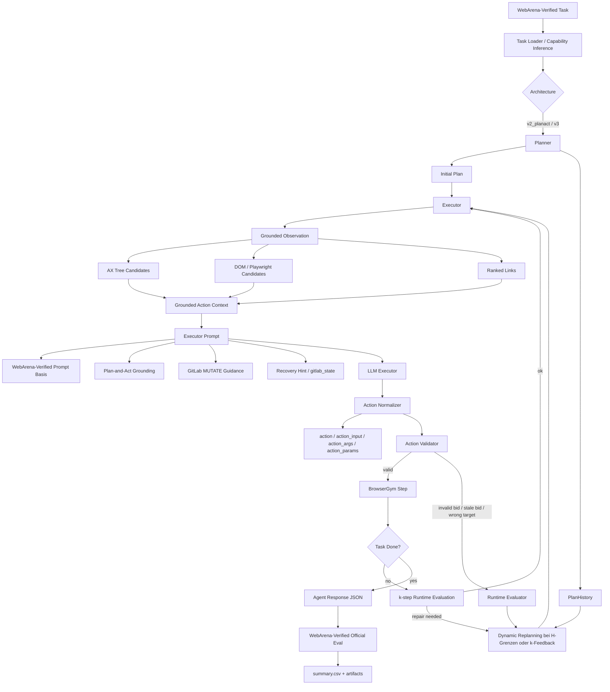
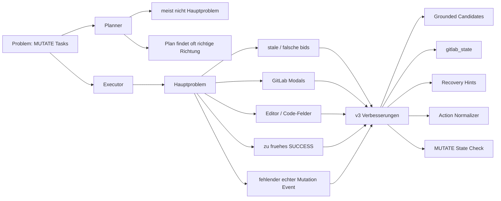
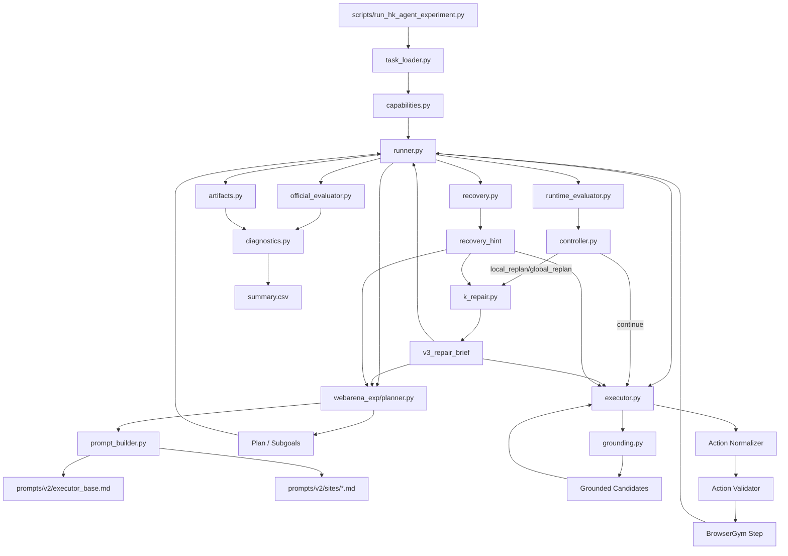
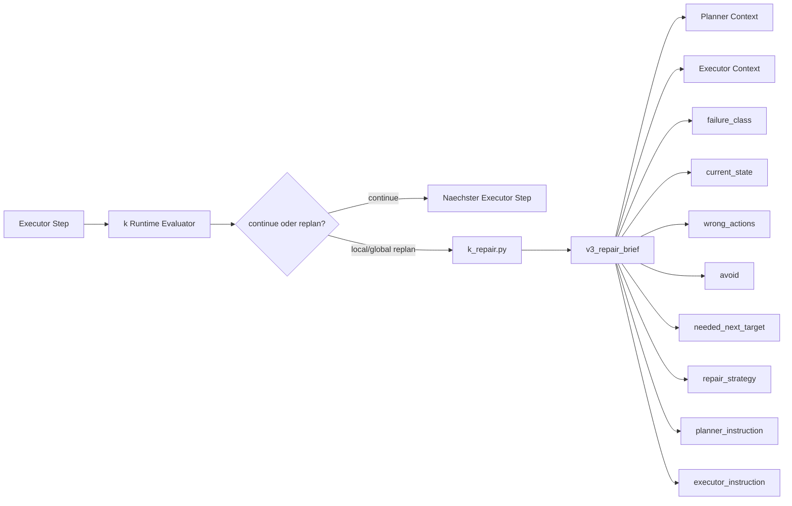

# v3 PlanAct-MUTATE Zwischenstand

Diese Notiz dokumentiert den aktuellen Stand der H/k-Agentenarchitektur, die
ersten H/k-Ergebnisse und die geplanten naechsten Schritte. Der Fokus liegt auf
MUTATE-Aufgaben, weil die bisherigen Fehler vor allem im Executor entstehen und
nicht im Planner.

## Aktuelle Architektur



## Fokus: MUTATE



Die bisherigen Analysen zeigen, dass der Planner haeufig den richtigen
Workflow-Kontext findet. Die Hauptprobleme entstehen danach im Executor:

- falsche oder alte `bid`s
- sichtbare Labels statt aktuelle BrowserGym-Kandidaten
- GitLab-Invite-Modals
- GitLab-Editoren und Code-Felder
- behauptetes `SUCCESS`, bevor ein echter Zustandswechsel passiert
- fehlender Mutation Event im offiziellen Network Trace

Deshalb wird Plan-and-Act nicht als vollstaendiger Runtime-Ersatz uebernommen,
sondern als Grundlage fuer eine staerker geerdete Executor-Architektur genutzt.
Die WebArena-Verified-Prompts bleiben die Basis; v3 erweitert sie um Grounding,
Zustandsdiagnose und Recovery.

## Relevante Module

Die aktuelle Architektur verteilt die Verantwortung bewusst auf mehrere kleine
Module. Dadurch bleibt nachvollziehbar, ob ein Fehler aus Planung,
Ausfuehrung, Grounding, k-Feedback oder offizieller Evaluation stammt.

| Modul / Datei | Rolle | Wichtigste Daten |
|---|---|---|
| `scripts/run_hk_agent_experiment.py` | CLI-Einstieg fuer Sweeps und Einzelruns | Task-IDs, H/k-Matrix, Architektur, Modelle, Budgets |
| `scripts/hk_agent/task_loader.py` | Laedt und rendert WebArena-Verified Tasks fuer BrowserGym | `HkTask`, `gym_id`, Site, Task-Metadaten |
| `scripts/hk_agent/capabilities.py` | Klassifiziert Task-Typ und Faehigkeiten | `MUTATE`, `RETRIEVE`, `NAVIGATE`, z. B. `mutate_gitlab_file_edit` |
| `scripts/hk_agent/runner.py` | Orchestriert den gesamten H/k-Loop | Planner Calls, Executor Steps, k-Evaluation, Replanning, Artefakte |
| `scripts/webarena_exp/planner.py` | Baut Planner-Prompts und ruft das Planner-LLM | `Plan`, `Subgoal`, PlanHistory, Repair-Briefs |
| `scripts/hk_agent/executor.py` | Baut Executor-Prompts, normalisiert und validiert Actions | BrowserGym Actions, `gitlab_state`, `v3_repair_brief`, Validation |
| `scripts/hk_agent/grounding.py` | Extrahiert aktuelle UI-Kandidaten aus AX Tree und DOM | `GroundedCandidate`, `bid`, role, text, context, cleaned HTML |
| `scripts/hk_agent/runtime_evaluator.py` | Bewertet alle k Schritte den Laufzustand | `EvaluatorSignal`, no-progress, invalid-action, recommended intervention |
| `scripts/hk_agent/k_repair.py` | Erstellt den neuen v3 k-Repair-Brief | `failure_class`, `repair_strategy`, `planner_instruction`, `executor_instruction` |
| `scripts/hk_agent/recovery.py` | Regelbasierte Fehlerdiagnosen fuer v3 | `recovery_hint`, stale bids, GitLab Modal/Editor/Fork-Fehler |
| `scripts/hk_agent/artifacts.py` | Schreibt strukturierte Artefakte | `step_trace.jsonl`, `planner_calls.jsonl`, `executor_calls.jsonl`, `runtime_evaluator_signals.jsonl` |
| `scripts/hk_agent/diagnostics.py` | Verdichtet Run-Fehler fuer `summary.csv` | Failure Categories, Mutation Diagnostics, Contamination Adjustment |
| `scripts/hk_agent/official_evaluator.py` | Startet die offizielle WebArena-Verified Evaluation | `eval_result.json`, Official Success, NetworkEventEvaluator |
| `scripts/hk_agent/prompt_builder.py` | Kombiniert WebArena-Verified-Basis mit Architektur-Prompts | WebArena-Verified Contract, Site-Prompts, v2/v3 Prompt-Basis |
| `prompts/v2/executor_base.md` | Allgemeine Executor-Regeln fuer v2/v3 | JSON-Format, Action-Vertrag, WebArena-Verified Response |
| `prompts/v2/sites/gitlab.md` | Allgemeine GitLab-Konventionen | Routen und Site-Kontext ohne task-spezifische Gold-Loesungen |
| `prompts/v3_repair_prompt.md` | Schema fuer den k-basierten Repair-Brief | Strukturierte Reparaturdiagnose fuer Planner und Executor |
| `tests/test_hk_agent_planact.py` | Unit Tests fuer v2_planact/v3-Komponenten | Grounding, Validator, Recovery, k-Repair, Parser-Normalisierung |

## Modulverbindungen



## Datenfluss in v3

1. `run_hk_agent_experiment.py` startet einen Sweep oder Einzelrun mit Task-IDs,
   H/k-Kombinationen, Architektur und Modellnamen.
2. `task_loader.py` laedt den WebArena-Verified Task und erzeugt die BrowserGym
   `gym_id`.
3. `capabilities.py` klassifiziert den Task, z. B. als `MUTATE` und
   `mutate_gitlab_group`.
4. `runner.py` startet BrowserGym, schreibt Artefakte und ruft den Planner.
5. `planner.py` erzeugt Subgoals. Bei v2_planact/v3 bekommt der Planner
   PlanHistory, Runtime Feedback und seit v3 auch `repair_briefs`.
6. `executor.py` baut den Executor-Kontext. Bei v3 enthaelt dieser Kontext:
   - `grounded_observation`
   - `action_candidates`
   - `gitlab_mutate_guidance`
   - `gitlab_state`
   - `recovery_hint`
   - `v3_repair_brief`
7. `grounding.py` extrahiert aktuelle Kandidaten aus AX Tree und DOM. Fuer
   GitLab werden Modals und Editor-aehnliche Kandidaten besonders markiert.
8. `executor.py` normalisiert Modellantworten wie `action_input`,
   `action_args`, `action_params` und validiert, dass UI-Actions aktuelle
   `bid`s nutzen.
9. BrowserGym fuehrt die Action aus.
10. Alle `k` Schritte erzeugt `runtime_evaluator.py` ein `EvaluatorSignal`.
11. Bei `local_replan` oder `global_replan` erzeugt `k_repair.py` einen
    `v3_repair_brief`.
12. Der Repair-Brief geht zurueck an Planner und Executor. Dadurch soll k nicht
    nur "kein Fortschritt" melden, sondern einen konkreten Reparaturauftrag
    liefern.
13. Nach dem Lauf erzeugt `official_evaluator.py` das offizielle
    `eval_result.json`; `diagnostics.py` verdichtet Ergebnis und Fehlerklasse
    fuer `summary.csv`.

## k-Repair-Schicht



Der `v3_repair_brief` ist kein neuer Planner und kein eigener Executor. Er ist
eine strukturierte Reparaturdiagnose. Das ist wichtig, weil k bisher nur grob
`invalid_action` oder `no_progress` signalisierte. Mit dem Repair-Brief wird
daraus ein konkreter Auftrag:

```json
{
  "repair_prompt_version": "v3_repair_prompt",
  "failure_class": "gitlab_invite_modal_repair",
  "current_state": "Invite members modal is visible.",
  "wrong_actions": ["fill(\"450\", \"JonasVautherin\")"],
  "avoid": ["Filter members", "background Invite members button"],
  "needed_next_target": "current inside-modal username/email input, role selector, suggestion, or Invite/Add button",
  "repair_strategy": "Continue inside the open modal. If modal candidates are missing, wait once with noop(1000) for refreshed candidates.",
  "planner_instruction": "Repair the invite-modal step; do not recreate the group or navigate away from the members page.",
  "executor_instruction": "Choose only current candidates marked inside_modal or whose placeholder/context mentions Username/email, role, or Invite."
}
```

## Modell- und Promptrollen

| Rolle | Aktuell verwendetes Modell / Prompt | Aufgabe |
|---|---|---|
| Planner LLM | `gemma4:26b` ueber Vertex/Ollama-Proxy | Subgoals planen und bei H/k-Feedback reparieren |
| Executor LLM | `gemma4:e4b` ueber Vertex/Ollama-Proxy | Eine konkrete BrowserGym Action fuer das aktuelle Subgoal erzeugen |
| k-Repair | regelbasiert in `k_repair.py`, Schema in `prompts/v3_repair_prompt.md` | Aus k-Feedback eine strukturierte Reparaturdiagnose erzeugen |
| Official Evaluator | WebArena-Verified Evaluatoren | Offizieller Success, Network Events, Agent Response |

Die k-Repair-Schicht ist aktuell bewusst nicht als LLM umgesetzt. Dadurch bleibt
sie reproduzierbar, guenstig und leichter fuer die Masterarbeit zu begruenden.
Falls die regelbasierte Diagnose nicht ausreicht, kann spaeter ein optionaler
LLM-basierter Repair Critic ergaenzt werden. Der aktuelle Stand ist aber
methodisch sauberer, weil keine zusaetzlichen Modellentscheidungen in die
Fehlerklassifikation eingefuehrt werden.

## Aktuelle H/k-Ergebnisse

Erfolg nach H/k fuer die aktuell gefilterte Matrix:

| h | k | total_runs | successes | success_rate |
|---:|---:|---:|---:|---:|
| 0 | 0 | 10 | 3 | 30.000000 |
| 0 | 2 | 10 | 3 | 30.000000 |
| 0 | 5 | 8 | 3 | 37.500000 |
| 0 | 10 | 8 | 3 | 37.500000 |
| 2 | 0 | 10 | 2 | 20.000000 |
| 2 | 2 | 10 | 5 | 50.000000 |
| 2 | 5 | 8 | 3 | 37.500000 |
| 2 | 10 | 7 | 2 | 28.571429 |
| 5 | 0 | 7 | 2 | 28.571429 |
| 5 | 2 | 7 | 2 | 28.571429 |
| 5 | 5 | 8 | 2 | 25.000000 |
| 5 | 10 | 8 | 2 | 25.000000 |
| 10 | 0 | 8 | 3 | 37.500000 |
| 10 | 2 | 8 | 2 | 25.000000 |
| 10 | 5 | 8 | 2 | 25.000000 |
| 10 | 10 | 8 | 3 | 37.500000 |

Der beste Zwischenwert liegt aktuell bei `h=2, k=2` mit 50 Prozent Success.
Das ist noch kein finales Ergebnis, weil die Matrix ungleich und teilweise
unvollstaendig ist. Es ist aber ein sinnvoller Hinweis darauf, dass ein kleiner
Planungshorizont mit regelmaessiger Evaluation/Replanung besser sein kann als
gar keine H/k-Steuerung oder sehr grosse H/k-Werte.

## Interpretation

`h=2, k=2` ist derzeit die plausibelste Kandidatenkombination fuer weitere
Tests. Sie erlaubt regelmaessige Korrektur, ohne nach jedem einzelnen Schritt
neu zu planen. Bei MUTATE-Aufgaben ist das besonders relevant, weil Fehler oft
erst nach einer UI-Aktion sichtbar werden, zum Beispiel bei Modals, Dropdowns
oder GitLab-Editoren.

Gleichzeitig zeigen GitLab-MUTATE-Tasks, dass der kritische Engpass im Executor
liegt. Der Agent kann oft erkennen, wo er hin muss, scheitert aber an der
ausfuehrbaren Interaktion mit dynamischen UI-Elementen.

Beispielhafte Fehlerklassen:

- `near miss`: richtiger Workflow-Kontext, aber fehlender Mutation Event
- `stale_bid`: Aktion verwendet eine alte oder nicht aktuelle `bid`
- `modal_candidate_missing`: Modal sichtbar, aber Input/Button nicht sauber als Kandidat geerdet
- `editor_target_missing`: Editor sichtbar, aber kein verlaesslicher Editor-Kandidat
- `premature_success`: Agent meldet Erfolg, bevor die Mutation offiziell nachweisbar ist

## Next Steps

```mermaid
flowchart TD
    A[Next Steps] --> B[1. GitLab MUTATE Retest]
    B --> B1[Tasks 522, 800, 444]
    B --> B2[h=2, k=2]
    B --> B3[v3 mit verbessertem Grounding]

    A --> C[2. Fehlerklassen auswerten]
    C --> C1[stale bid]
    C --> C2[modal candidate missing]
    C --> C3[editor target missing]
    C --> C4[premature success]
    C --> C5[step/planner budget]

    A --> D[3. Groesseres Hard-Set vorbereiten]
    D --> D1[nicht seitenuebergreifende Tasks]
    D --> D2[ca. 200 Tasks]
    D --> D3[zuerst kleiner Smoke-Test]

    A --> E[4. Laufzeit/Kosten planen]
    E --> E1[ca. 10 Minuten pro Run]
    E --> E2[volle Matrix dauert sehr lange]
    E --> E3[erst 10-20 Tasks testen]
    E --> E4[dann Hauptlauf starten]

    A --> F[5. Masterarbeitsauswertung]
    F --> F1[Official Success]
    F --> F2[Near Miss / Progress]
    F --> F3[Mutation Event vorhanden?]
    F --> F4[Tokenkosten]
    F --> F5[Laufzeit]
```



## Vorgeschlagener Ablauf

1. GitLab-MUTATE Mini-Retest:
   - Tasks: `522`, `800`, `444`
   - Kombination: `h=2`, `k=2`
   - Architektur: `v3`
   - Ziel: Pruefen, ob die neuen Grounding- und Recovery-Mechanismen die
     bisherigen GitLab-Fehlerklassen reduzieren.

2. Kleiner gemischter Smoke-Test:
   - etwa 10 bis 20 nicht seitenuebergreifende Tasks
   - Kategorien: Reddit, GitLab, Shopping, Shopping Admin
   - nur wenige H/k-Kombinationen, zum Beispiel `0/0`, `2/2`, `0/5`,
     eventuell `10/10`

3. Hauptlauf:
   - alle nicht seitenuebergreifenden Tasks, etwa 200 Stueck
   - reduzierte H/k-Matrix statt alle Kombinationen blind
   - Vergleich nach Success, Laufzeit, Tokens und Utility

Da ein Run je nach Task ungefaehr 10 Minuten dauern kann, sollte der komplette
Hard-Set-Lauf erst nach kleinen Tests gestartet werden. Bei 200 Tasks und
mehreren H/k-Kombinationen entstehen sonst sehr lange Laufzeiten.

## Kurzform fuer die Masterarbeit

Die bisherigen Ergebnisse deuten darauf hin, dass der Planner nicht der
primaere Engpass ist. Der Agent findet haeufig den richtigen Workflow-Kontext,
scheitert jedoch bei MUTATE-Aufgaben an der ausfuehrbaren Interaktion mit
dynamischen UI-Elementen. Deshalb wird Plan-and-Act nicht als vollstaendiger
Ersatz uebernommen, sondern als Grundlage fuer eine staerker geerdete
Executor-Architektur genutzt. v3 erweitert v2_planact um DOM-/AX-Grounding,
GitLab-spezifische MUTATE-Zustandsdiagnose, Recovery-Hints und strengere
Action-Validierung. Erste H/k-Ergebnisse zeigen, dass `h=2, k=2` mit 50 Prozent
Success in der aktuell gefilterten Matrix am besten abschneidet. Dieser Befund
muss jedoch wegen unvollstaendiger und ungleich verteilter Runs noch breiter
validiert werden.
