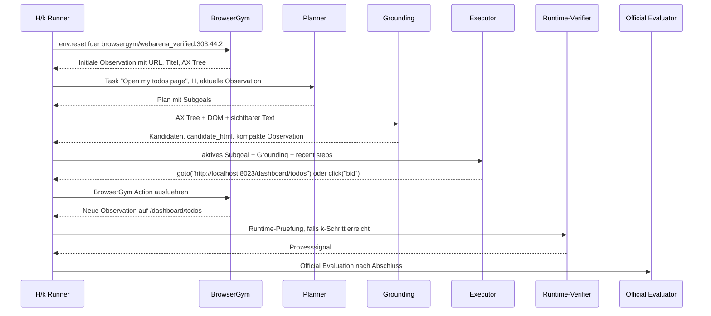

# Beispielhafter Agentenlauf fuer Task 44

```latex
\section{Beispielhafter Agentenlauf für Task 44}
\label{app:task44-agentenlauf}
```

Dieses Dokument beschreibt Task 44 als konkretes Beispiel fuer die Umsetzung der
H/k-Agentenarchitektur. Der Task wurde in der Entwicklung als frueher
Sanity-Check genutzt, weil er einfach genug ist, um die gesamte Kette aus
Taskdefinition, manueller Ausfuehrung, BrowserGym-Aktion, Runtime-Pruefung,
Logging und offizieller Evaluation nachvollziehbar zu zeigen.

## Taskdefinition und Ausfuehrungskonfiguration

```latex
\subsection{Taskdefinition und Ausführungskonfiguration}
```

Task 44 ist eine GitLab-Navigationsaufgabe. Der natuerliche Sprachauftrag
lautet:

```text
Open my todos page
```

Die relevante Taskdefinition lautet sinngemaess:

```json
{
  "sites": ["gitlab"],
  "task_id": 44,
  "intent_template_id": 303,
  "start_urls": ["__GITLAB__"],
  "intent": "Open my todos page",
  "eval": [
    {
      "evaluator": "AgentResponseEvaluator",
      "expected": {
        "task_type": "NAVIGATE",
        "status": "SUCCESS",
        "retrieved_data": null,
        "error_details": null
      }
    },
    {
      "evaluator": "NetworkEventEvaluator",
      "expected": {
        "url": [
          "__GITLAB__/dashboard/todos",
          "__GITLAB__/dashboard/todos?state=pending"
        ],
        "http_method": "GET",
        "response_status": 200
      }
    }
  ],
  "revision": 2
}
```

In der lokalen WebArena-Verified-Umgebung wird `__GITLAB__` durch die lokale
GitLab-Instanz ersetzt, typischerweise:

```text
http://localhost:8023
```

Der Zielzustand ist damit eine der folgenden URLs:

```text
http://localhost:8023/dashboard/todos
http://localhost:8023/dashboard/todos?state=pending
```

Der Task verlangt keine Informationsextraktion und keine Mutation. Er ist
erfuellt, wenn die Todo-Seite erreicht wurde und die finale Agentenantwort als
erfolgreiche Navigationsaufgabe gespeichert ist.

Eine passende H/k-Ausfuehrung kann beispielsweise so konfiguriert werden:

```bash
uv run python scripts/run_hk_agent_experiment.py \
  --experiment-name hk-agent-task44-example \
  --task-ids 44 \
  --hs 2 \
  --ks 1 \
  --run-mode agent \
  --planner-model gemma4:26b \
  --executor-model gemma4:e4b \
  --agent-architecture v3 \
  --max-steps-policy tiered \
  --max-steps-navigation 20 \
  --llm-timeout-seconds 600 \
  --ollama-base-url http://127.0.0.1:11435 \
  --resume-summary \
  --replace-requested-runs \
  --refresh-existing-diagnostics
```

Die konkrete Konfiguration ist fuer das Beispiel nicht entscheidend. Wichtig ist
die Semantik: `H=2` erlaubt dem Planner einen kurzen Planungsausschnitt mit bis
zu zwei Subgoals, waehrend `k=1` nach jedem Executor-Schritt eine
Runtime-Pruefung aktiviert.

Zum Vergleich wurde Task 44 in der fruehen Entwicklung auch manuell bzw.
deterministisch geloest. Ein Mensch wuerde im Browser die lokale GitLab-Seite
oeffnen, sich bei Bedarf mit den Benchmark-Zugangsdaten anmelden und dann die
Todo-Seite unter `/dashboard/todos` aufrufen. Die fruehen Runner

```text
scripts/archive/legacy_runners/run_gitlab_task44_navigate_runner.py
scripts/archive/legacy_runners/run_browsergym_gitlab_task44_runner.py
```

haben genau diesen Ablauf ohne LLM ausgefuehrt. Sie dienten dazu, den
Artefaktvertrag aus `network.har`, `agent_response.json` und offizieller
Evaluation zu validieren.

## Initiale Observation und Grounding

```latex
\subsection{Initiale Observation und Grounding}
```

Der Agentenlauf startet mit einem BrowserGym-Reset fuer die zu Task 44 gehoerende
Gym-ID:

```text
browsergym/webarena_verified.303.44.2
```

Nach `env.reset()` liefert BrowserGym eine initiale Observation. Diese enthaelt
unter anderem:

- aktuelle URL,
- Seitentitel,
- Accessibility Tree,
- sichtbare Texte,
- letzte Aktion,
- letzten Aktionsfehler,
- Browser-/Playwright-Kontext.

Bei Task 44 kann die initiale Seite je nach Sessionzustand entweder die
GitLab-Loginseite oder bereits eine authentifizierte GitLab-Seite sein. Der
Runner stabilisiert den Login ueber BrowserGym/WebArena-Verified, sodass der
Agent anschliessend auf einer nutzbaren GitLab-Oberflaeche arbeiten kann.

Fuer den Planner wird diese Observation stark zusammengefasst. Der Planner sieht
nicht den gesamten DOM-Baum, sondern eine kompakte Zustandsbeschreibung, etwa:

```text
current_url: http://localhost:8023/...
page_title: GitLab
last_action:
last_action_error:
```

Fuer den Executor wird dagegen eine handlungsnaehere Sicht aufgebaut.
`hk_agent.grounding` kombiniert dafuer Accessibility Tree und Live DOM. Daraus
entstehen interaktive Kandidaten mit aktuellen BrowserGym-`bid`s:

```json
[
  {
    "bid": "17",
    "role": "link",
    "text": "Todos",
    "href": "http://localhost:8023/dashboard/todos",
    "source": "dom+ax"
  },
  {
    "bid": "42",
    "role": "link",
    "text": "Dashboard",
    "href": "http://localhost:8023/dashboard",
    "source": "dom+ax"
  }
]
```

Das konkrete `bid` ist laufzeitabhaengig und muss nicht genau diesen Zahlen
entsprechen. Entscheidend ist, dass der Executor nicht frei `click("Todos")`
erfinden soll, sondern ein aktuell sichtbares und vom Grounding extrahiertes
Zielelement verwenden kann.

Zusaetzlich werden gekuerzte HTML-Fragmente erzeugt. Statt eines vollstaendigen
HTML-Dumps bekommt der Executor nur relevante, bereinigte Ausschnitte:

```html
<a data-label-id="17" href="http://localhost:8023/dashboard/todos" role="link">
  Todos
</a>
```

Diese Reduktion senkt Tokenkosten, reduziert HTML-Rauschen und verhindert, dass
der Executor durch irrelevante DOM-Details abgelenkt wird.

## Planner- und Executor-Ausgaben

```latex
\subsection{Planner- und Executor-Ausgaben}
```

Der Planner verarbeitet den sanitisierten Taskauftrag:

```text
Open my todos page
```

Bei Task 44 kann ein plausibler Plan aus zwei Subgoals bestehen:

```json
{
  "subgoals": [
    {
      "id": "sg1",
      "objective": "Open GitLab and ensure the user is authenticated.",
      "expected_outcome": "The GitLab dashboard or another authenticated GitLab page is visible."
    },
    {
      "id": "sg2",
      "objective": "Navigate to the user's todos page.",
      "expected_outcome": "The browser is on the GitLab todos dashboard."
    }
  ]
}
```

Der Executor erhaelt anschliessend das aktive Subgoal, die kompakte Observation,
die Grounding-Kandidaten, sichtbare Linkziele und die letzten Schritte. Fuer
Task 44 gibt es zwei naheliegende Loesungswege.

Erstens kann der Executor direkt zur bekannten GitLab-Todo-Route navigieren:

```json
{
  "action_type": "goto",
  "action": "goto(\"http://localhost:8023/dashboard/todos\")",
  "rationale_summary": "The task asks to open the user's todos page; GitLab exposes it at /dashboard/todos.",
  "expected_observation": "The GitLab todos page is visible."
}
```

Zweitens kann der Executor ein sichtbares UI-Element verwenden, wenn das
Grounding einen entsprechenden Kandidaten enthaelt:

```json
{
  "action_type": "click",
  "action": "click(\"17\")",
  "rationale_summary": "Candidate 17 is the visible Todos link.",
  "expected_observation": "The browser opens the todos dashboard."
}
```

Beide Varianten sind methodisch zulässig, solange sie auf der aktuellen
Observation beruhen und keine Evaluator- oder Goldinformationen verwenden. Der
erste Weg nutzt eine allgemeine GitLab-Routenkonvention, der zweite Weg nutzt
ein aktuell sichtbares BrowserGym-Zielelement.

Die Sequenz des Agentenlaufs laesst sich zusammenfassend so darstellen:



## Runtime-Pruefung und Controller-Entscheidung

```latex
\subsection{Runtime-Prüfung und Controller-Entscheidung}
```

Bei `k=1` wird nach dem ersten Executor-Schritt eine Runtime-Pruefung
ausgefuehrt. Der Runtime-Verifier bewertet dabei nicht den offiziellen
Benchmarkerfolg, sondern nur beobachtbare Prozesssignale.

Nach einer erfolgreichen Navigation auf `/dashboard/todos` sind fuer Task 44
typischerweise folgende Signale plausibel:

```json
{
  "progress_score": 0.6,
  "subgoal_done": true,
  "invalid_action": false,
  "no_progress": false,
  "loop_detected": false,
  "recommended_intervention": "continue",
  "reason": "observable_progress"
}
```

Wenn der Executor bereits eine finale Antwort erzeugt oder der Runner bei einer
NAVIGATE-Aufgabe den Zielzustand als sichtbar erfuellt erkennt, kann der Lauf
danach abgeschlossen werden. Falls stattdessen kein Fortschritt sichtbar waere,
zum Beispiel durch wiederholtes Oeffnen derselben falschen Seite, koennte der
Runtime-Verifier `no_progress` oder `loop_detected` markieren. Der Controller
wuerde daraus typischerweise eine Replanning-Entscheidung ableiten.

Eine moegliche Controller-Entscheidung nach erfolgreicher Navigation lautet:

```json
{
  "decision": "continue",
  "reason_code": "progress_observed"
}
```

Falls der Task noch nicht final waere, wuerde der Agent mit dem aktuellen Plan
weiterarbeiten. Bei Task 44 ist der Lauf nach Erreichen der Todo-Seite jedoch
praktisch abgeschlossen.

Wichtig ist die wissenschaftliche Trennung:

- Der Runtime-Verifier erzeugt Prozesssignale fuer Replanning und Diagnostik.
- Der Controller entscheidet ueber Fortsetzen, Replanning oder Abbruch.
- Der offizielle Erfolg wird erst nachgelagert durch WebArena-Verified bestimmt.

## Abschlussantwort und offizielle Evaluation

```latex
\subsection{Abschlussantwort und offizielle Evaluation}
```

Nach der Navigation schreibt der Runner eine WebArena-Verified-kompatible
Abschlussantwort. Fuer Task 44 lautet diese:

```json
{
  "task_type": "NAVIGATE",
  "status": "SUCCESS",
  "retrieved_data": null,
  "error_details": null
}
```

Diese Antwort wird als `agent_response.json` gespeichert. Parallel wurde der
Browserlauf als `network.har` aufgezeichnet. Der offizielle Evaluator prueft
anschliessend insbesondere zwei Bedingungen:

1. Die Agentenantwort meldet `NAVIGATE` und `SUCCESS`.
2. Im HAR ist eine erwartete Anfrage auf `/dashboard/todos` bzw.
   `/dashboard/todos?state=pending` enthalten.

Der offizielle Erfolg entsteht damit nicht dadurch, dass der Agent selbst
behauptet, fertig zu sein, und auch nicht dadurch, dass der Runtime-Verifier
Fortschritt erkennt. Entscheidend ist die nachgelagerte WebArena-Verified-
Evaluation.

Ein erfolgreiches Ergebnis wird in der Run-Summary beispielsweise so sichtbar:

```json
{
  "task_id": 44,
  "task_type": "NAVIGATE",
  "official_score": 1.0,
  "official_success": true,
  "official_eval_status": "success"
}
```

## Erzeugte Laufartefakte

```latex
\subsection{Erzeugte Laufartefakte}
```

Auch dieser einfache Task erzeugt die normalen Run-Artefakte:

| Artefakt | Beispielinhalt bei Task 44 |
|---|---|
| `step_trace.jsonl` | Reset, ausgefuehrte `goto`- oder `click`-Aktionen, URLs vor/nach der Aktion. |
| `planner_calls.jsonl` | Planner-Aufruf mit `H`, Modellname, Tokenzahlen und Planvorschau. |
| `executor_calls.jsonl` | Executor-Aufruf mit Action, Begruendung, Tokenzahlen und Latenz. |
| `runtime_evaluator_signals.jsonl` | Bei `k>0` Prozesssignal nach dem Schritt. |
| `controller_decisions.jsonl` | Entscheidung wie `continue`, `local_replan` oder Abschlusskontext. |
| `executor_prompts/` | Prompt-Snapshots, die den an den Executor gegebenen Kontext dokumentieren. |
| `executor_grounding/` | Grounding-Snapshots mit Kandidaten und Validierungsinformationen. |
| `network.har` | Netzwerkereignisse, darunter der GET-Request auf `/dashboard/todos`. |
| `agent_response.json` | Finale WebArena-Verified-Antwort fuer `NAVIGATE/SUCCESS`. |
| `eval_result.json` | Offizielle Bewertung durch WebArena-Verified. |
| `run_summary.json` | Zusammenfassung mit `official_success`, Runtime, Tokens, Steps und Artefaktpfaden. |

Das Run-Verzeichnis folgt der allgemeinen Struktur:

```text
runs/hk-agent/<experiment-name>/gitlab/44/h<H>_k<k>/44/
```

Fuer die Beispielkonfiguration `H=2` und `k=1` waere also ein Pfad dieser Form
zu erwarten:

```text
runs/hk-agent/hk-agent-task44-example/gitlab/44/h2_k1/44/
```

## Vergleich mit einem Plan-and-Act-Beispiel

Ein allgemeines Plan-and-Act-Beispiel waere:

```text
Follow the top contributor of this GitHub project.
```

Dort muesste der Planner die Aufgabe in mehrere fachliche Schritte zerlegen:

1. Projektseite oeffnen.
2. Contributors-Bereich finden.
3. Top Contributor identifizieren.
4. Profil des Contributors oeffnen.
5. Follow-Aktion ausfuehren.

Task 44 ist einfacher, zeigt aber dieselbe Struktur:

1. GitLab oeffnen und gegebenenfalls authentifiziert sein.
2. Die eigene Todo-Seite oeffnen.
3. Navigationsabschluss melden.

Der didaktische Nutzen von Task 44 liegt deshalb in der Klarheit. Man sieht an
einem kleinen Beispiel, wie Task, Planner-Subgoals, Executor-Action,
BrowserGym-Ausfuehrung, HAR-Aufzeichnung und offizielle Evaluation
zusammenhaengen.

