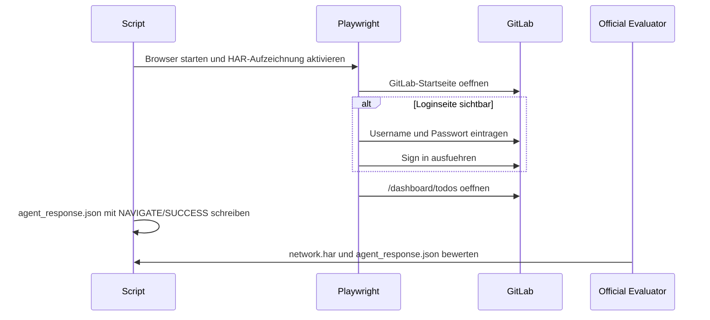
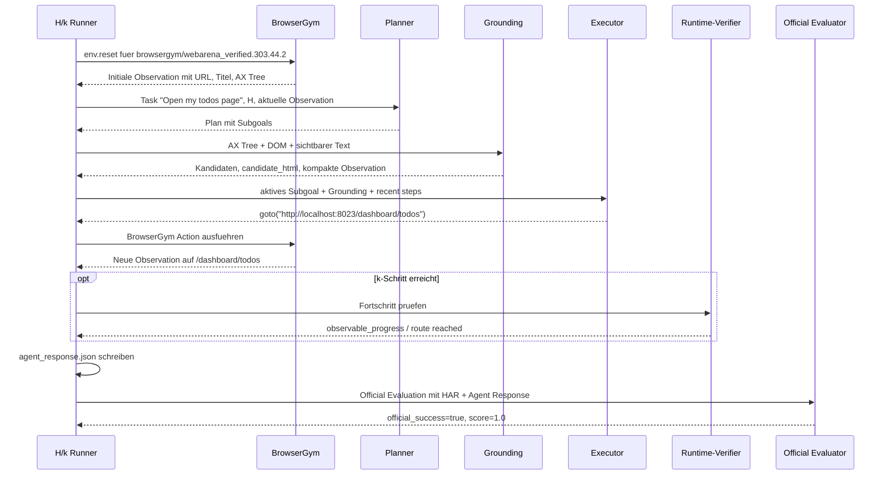

# Beispielhafte Durchfuehrung: WebArena-Verified Task 44

Dieses Dokument beschreibt Task 44 als konkretes Beispiel fuer die Umsetzung der
H/k-Agentenarchitektur. Der Task wurde in der Entwicklung als frueher
Sanity-Check genutzt, weil er einfach genug ist, um die gesamte Kette aus
Taskdefinition, manueller Ausfuehrung, BrowserGym-Aktion, Logging und offizieller
Evaluation nachvollziehbar zu zeigen.

## Taskdefinition

Task 44 ist eine GitLab-Navigationsaufgabe. Der natuerliche Sprachauftrag lautet:

```text
Open my todos page
```

Die relevante Taskdefinition lautet sinngemaess:

```json
{
  "sites": ["gitlab"],
  "task_id": 44,
  "intent_template_id": 303,
  "start_urls": ["__GITLAB__"],
  "intent": "Open my todos page",
  "eval": [
    {
      "evaluator": "AgentResponseEvaluator",
      "expected": {
        "task_type": "NAVIGATE",
        "status": "SUCCESS",
        "retrieved_data": null,
        "error_details": null
      }
    },
    {
      "evaluator": "NetworkEventEvaluator",
      "expected": {
        "url": [
          "__GITLAB__/dashboard/todos",
          "__GITLAB__/dashboard/todos?state=pending"
        ],
        "http_method": "GET",
        "response_status": 200
      }
    }
  ],
  "revision": 2
}
```

In der lokalen WebArena-Verified-Umgebung wird `__GITLAB__` durch die lokale
GitLab-Instanz ersetzt, typischerweise:

```text
http://localhost:8023
```

Der Zielzustand ist damit:

```text
http://localhost:8023/dashboard/todos
```

oder alternativ:

```text
http://localhost:8023/dashboard/todos?state=pending
```

Der Task verlangt keine Informationsextraktion und keine Mutation. Er ist
erfuellt, wenn die Todo-Seite erreicht wurde und die finale Agentenantwort als
erfolgreiche Navigationsaufgabe gespeichert ist.

## Manuelle Loesung

Wenn ein Mensch Task 44 manuell ausfuehrt, passiert im Kern Folgendes:

1. Die lokale GitLab-Webseite wird geoeffnet.
2. Falls GitLab noch nicht eingeloggt ist, erfolgt der Login mit den
   Benchmark-Zugangsdaten.
3. Nach dem Login wird die eigene Todo-Seite geoeffnet.
4. Die Todo-Seite ist in GitLab ueber `/dashboard/todos` erreichbar.
5. Sobald diese Seite geladen ist, ist der Navigationsauftrag erfuellt.

Manuell kann der Task entweder ueber die GitLab-Oberflaeche geloest werden oder
direkt durch Eingabe der Zieladresse:

```text
http://localhost:8023/dashboard/todos
```

Fuer den Benchmark ist entscheidend, dass der Browserlauf die erwartete Seite
erreicht und dass die finale Agentenantwort formal dem Tasktyp `NAVIGATE`
entspricht.

## Frueher nicht-LLM-basierter Sanity-Check

In den fruehen Implementierungsschritten wurde Task 44 zuerst deterministisch
geloest. Der minimale Playwright-Runner lag unter:

```text
scripts/archive/legacy_runners/run_gitlab_task44_navigate_runner.py
```

Der Zweck war nicht, bereits einen autonomen Agenten zu testen, sondern den
Artefaktvertrag der WebArena-Verified-Evaluation zu pruefen:

- Wird ein `network.har` erzeugt?
- Wird eine gueltige `agent_response.json` erzeugt?
- Kann der offizielle Evaluator den Lauf auswerten?
- Erhaelt Task 44 bei korrekter Navigation `score = 1.0`?

Der Ablauf war:



Danach wurde dieselbe Aufgabe ueber BrowserGym geloest:

```text
scripts/archive/legacy_runners/run_browsergym_gitlab_task44_runner.py
```

Die fachliche Loesung war weiterhin deterministisch, aber die technische
Schnittstelle entsprach bereits der spaeteren Agentenarchitektur:

```text
goto("http://localhost:8023/dashboard/todos")
```

Dieser Schritt war wichtig, weil dadurch klar wurde, dass BrowserGym-Actions,
HAR-Aufzeichnung, Agentenantwort und offizieller Evaluator zusammen funktionieren.

## Durchfuehrung mit dem H/k-Agenten

In der H/k-Architektur wird Task 44 nicht mehr durch einen hartcodierten
Task-44-Runner geloest. Der Agent bekommt im `agent`-Modus nur den sanitisierten
Taskauftrag:

```text
Open my todos page
```

Der Planner und Executor muessen daraus selbst eine Strategie ableiten. Fuer
Task 44 kann der Planner beispielsweise zwei Subgoals erzeugen:

```json
{
  "subgoals": [
    {
      "id": "sg1",
      "objective": "Open GitLab and ensure the user is authenticated.",
      "expected_outcome": "The GitLab dashboard or another authenticated GitLab page is visible."
    },
    {
      "id": "sg2",
      "objective": "Navigate to the user's todos page.",
      "expected_outcome": "The browser is on the GitLab todos dashboard."
    }
  ]
}
```

Der Executor setzt ein aktives Subgoal in eine konkrete BrowserGym-Aktion um.
Fuer das zweite Subgoal ist eine plausible Aktion:

```json
{
  "action_type": "goto",
  "action": "goto(\"http://localhost:8023/dashboard/todos\")",
  "rationale_summary": "The task asks to open the user's todos page; GitLab exposes it at /dashboard/todos.",
  "expected_observation": "The GitLab todos page is visible."
}
```

Alternativ kann der Executor ueber die UI navigieren. Dann wuerde er ein
aktuelles BrowserGym-`bid` aus dem Grounding verwenden:

```text
click("42")
```

Dabei steht `42` nicht fuer eine frei erfundene Zielbeschreibung, sondern fuer
ein aktuell sichtbares, vom Grounding extrahiertes Interaktionselement.

## Sequenz im Agentenlauf



## Was geloggt wird

Auch dieser einfache Task erzeugt die normalen Run-Artefakte:

| Artefakt                            | Beispielinhalt bei Task 44                                                           |
| ----------------------------------- | ------------------------------------------------------------------------------------ |
| `step_trace.jsonl`                | Reset, ausgefuehrte `goto`- oder `click`-Aktionen, URLs vor/nach der Aktion.     |
| `planner_calls.jsonl`             | Planner-Aufruf mit `H`, Modellname, Tokenzahlen und Planvorschau.                  |
| `executor_calls.jsonl`            | Executor-Aufruf mit Action, Begruendung, Tokenzahlen und Latenz.                     |
| `runtime_evaluator_signals.jsonl` | Bei `k>0` Prozesssignal nach dem Schritt.                                          |
| `controller_decisions.jsonl`      | Entscheidung wie `continue`, `local_replan` oder Abschlusskontext.               |
| `network.har`                     | Netzwerkereignisse, darunter der GET-Request auf `/dashboard/todos`.               |
| `agent_response.json`             | Finale WebArena-Verified-Antwort fuer `NAVIGATE/SUCCESS`.                          |
| `eval_result.json`                | Offizielle Bewertung durch WebArena-Verified.                                        |
| `run_summary.json`                | Zusammenfassung mit `official_success`, Runtime, Tokens, Steps und Artefaktpfaden. |

Der offizielle Erfolg entsteht nicht durch den Runtime-Verifier, sondern durch
die nachgelagerte WebArena-Verified-Evaluation. Diese prueft bei Task 44
insbesondere:

1. Die Agentenantwort meldet `NAVIGATE` und `SUCCESS`.
2. Im HAR ist die erwartete Todo-URL als Netzwerkereignis enthalten.

## Vergleich mit einem Plan-and-Act-Beispiel

Ein allgemeines Plan-and-Act-Beispiel waere:

```text
Follow the top contributor of this GitHub project.
```

Dort muesste der Planner die Aufgabe in mehrere fachliche Schritte zerlegen:

1. Projektseite oeffnen.
2. Contributors-Bereich finden.
3. Top Contributor identifizieren.
4. Profil des Contributors oeffnen.
5. Follow-Aktion ausfuehren.

Task 44 ist einfacher, zeigt aber dieselbe Struktur:

1. GitLab oeffnen und gegebenenfalls authentifiziert sein.
2. Die eigene Todo-Seite oeffnen.
3. Navigationsabschluss melden.

Der didaktische Nutzen von Task 44 liegt deshalb in der Klarheit. Man sieht an
einem kleinen Beispiel, wie Task, Planner-Subgoals, Executor-Action,
BrowserGym-Ausfuehrung, HAR-Aufzeichnung und offizielle Evaluation
zusammenhaengen.
